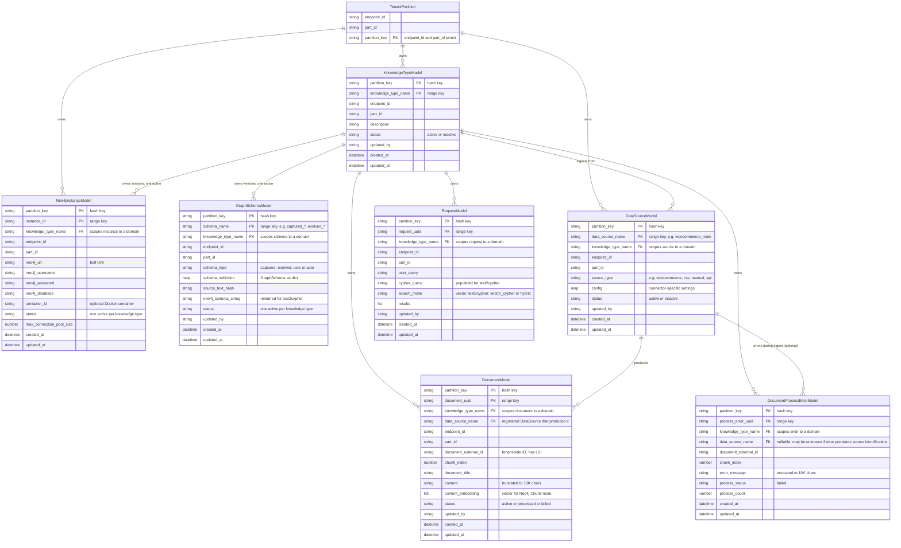

# Knowledge Graph Engine — Data Model (proposed v2)

This document describes the proposed evolution of the engine's data model that introduces **`KnowledgeTypeModel`** as the primary organizational unit within a tenant partition. A knowledge type is a self-contained domain (for example "products", "support_tickets", "internal_wiki") with its own dedicated Neo4j instance, schema, data sources, documents, and request log.

The current production model (a flat partition with a single active schema and a single active Neo4j instance) is documented in [development_plan.md → Phase 2](./development_plan.md#phase-2-data--model-layer). This file proposes the next iteration.

---

## Goals

1. **Multiple knowledge domains per tenant** — let one partition (`endpoint_id` + `part_id`) host several independent knowledge graphs, each with its own schema and Neo4j storage.
2. **First-class data sources** — replace the free-form `document_source` string on `DocumentModel` with a registered `DataSourceModel` entity, so ingestion can be configured, audited, and re-run per source.
3. **Strict scoping** — every queryable entity (Document, Request, Error) is scoped to a knowledge type, so cross-domain leakage is impossible by construction.
4. **Versioning preserved** — Neo4j instances and graph schemas keep the existing "one active, history retained as inactive" pattern, but now per knowledge type instead of per partition.

---

## Cardinality Summary

Cardinality below describes **storage**, i.e. how many rows can exist in DynamoDB. The "one active at a time" invariant is a separate constraint applied on top, enforced by application code and the `status` field. Naming uses the Python class name (`*Model` suffix) throughout for consistency with the diagram.

| From | To | Cardinality | Notes |
|---|---|:---:|---|
| `TenantPartition` | `KnowledgeTypeModel` | 1 : N | A tenant can host any number of knowledge domains |
| `TenantPartition` | `Neo4jInstanceModel` | 1 : N | Sum across knowledge types (each KT owns its own instances) |
| `TenantPartition` | `DataSourceModel` | 1 : N | Sum across knowledge types |
| `KnowledgeTypeModel` | `Neo4jInstanceModel` | 1 : N | Versioned — many rows, at most one with `status="active"` |
| `KnowledgeTypeModel` | `GraphSchemaModel` | 1 : N | Versioned — many rows, at most one with `status="active"` |
| `KnowledgeTypeModel` | `DataSourceModel` | 1 : N | A knowledge type ingests from many sources — multiple may be active concurrently |
| `KnowledgeTypeModel` | `DocumentModel` | 1 : N | All extracted documents live under a knowledge type |
| `KnowledgeTypeModel` | `RequestModel` | 1 : N | All search and RAG requests are logged per knowledge type |
| `DataSourceModel` | `DocumentModel` | 1 : N | Each document originates from exactly one data source |
| `DataSourceModel` | `DocumentProcessErrorModel` | 1 : N | Errors during ingest are attributed to their source (nullable) |

The "1 active at any time" invariant applies only to:

- `Neo4jInstanceModel` — at most one row per `(partition_key, knowledge_type_name)` has `status="active"`
- `GraphSchemaModel` — same scope

`KnowledgeTypeModel` and `DataSourceModel` use `status` for soft-disable/archive only — multiple rows can be `active` simultaneously within their respective parent scope (a partition for knowledge types, a knowledge type for data sources).

---

## Entity-Relationship Diagram



**Where is the Neo4j graph data?**
The actual `Chunk`, `Entity`, and `Relationship` nodes live inside each `Neo4jInstanceModel`'s Neo4j database — not in DynamoDB. Each knowledge type's active `Neo4jInstanceModel` is its physical storage; the vector index is created per-instance, so cross-knowledge-type vector search is impossible by construction. The graph contents are not modeled as DynamoDB entities and so are intentionally absent from this ER diagram.

---

## Notes on the Model

### Composite Primary Keys

Every DynamoDB table uses a composite key of `partition_key` (hash) + a per-table range key. The Mermaid diagram marks both as `PK` because together they form the primary key. The comment on each row clarifies which is the hash key and which is the range key. Mermaid's `erDiagram` only recognizes `PK`, `FK`, `UK` — there is no `SK` marker, so a composite PK is the correct way to express a hash + range key pair.

### "One Active per Knowledge Type"

`Neo4jInstanceModel` and `GraphSchemaModel` retain the existing **one-active-per-scope** invariant, but the scope is now `(partition_key, knowledge_type_name)` instead of `partition_key` alone. Implementation:

- Insert/activate triggers `_deactivate_current_active_*(partition_key, knowledge_type_name, exclude_*=current)` on the matching scope.
- Old versions are flipped to `status = "inactive"` rather than deleted, preserving full version history.
- Lookups use `get_active_*(partition_key, knowledge_type_name)`.

At the storage level this is **1:N** (one knowledge type, many rows); the "1 active" invariant is enforced by application code and surfaced in the diagram labels.

`KnowledgeTypeModel` and `DataSourceModel` do **not** enforce active-singleton. Multiple knowledge types may be active in the same partition concurrently (the whole point — `products`, `support_tickets`, `internal_wiki` running side by side), and a knowledge type may ingest from several active data sources simultaneously (`woocommerce_main`, `manual_csv`, etc.). The `status` field exists for soft-disable and archive, not uniqueness.

### Foreign-Key Semantics

DynamoDB has no foreign-key enforcement. The `FK` markers in the diagram describe **logical references** — they are validated by application code:

- A `DocumentModel` write must specify `knowledge_type_name` and `data_source_name` that already exist (and are active) within the same partition.
- `DocumentProcessErrorModel.data_source_name` is **nullable** because errors can occur before a data source is identified (e.g., malformed extract request, missing config). The diagram label "errors during ingest (optional)" reflects this.

### Cache Invalidation Hierarchy

`CascadingCachePurger` keys cache buckets by the model module's snake-case name (`"knowledge_type"`, `"data_source"`, etc.), not by the Python class name. This convention is independent of the diagram's `*Model` naming. Proposed cascade:

```python
CACHE_RELATIONSHIPS = {
    "knowledge_type": [
        "neo4j_instance", "graph_schema", "data_source",
        "document", "request", "document_process_error",
    ],
    "data_source":    ["document", "document_process_error"],
    "document":       ["request"],
}
```

A delete or status change on a `knowledge_type` cascades to all six dependent entity caches; a `data_source` change cascades to documents and errors; a `document` change cascades to the request cache.

### `data_source_name` Replaces `document_source`

Today `DocumentModel.document_source` is a free-form string (`"woocommerce"`, `"manual"`, etc.). In the proposed model, this becomes `data_source_name` — a foreign key to a registered `DataSourceModel` row. Benefits:

- Per-source connector config (URLs, credentials, polling interval) lives on `DataSourceModel.config`, not in `.env`.
- Audit trail: every document is traceable to a specific configured source.
- Re-ingestion: re-running a source is a deterministic operation against a registered config.
- Validation: writing a document with an unknown `data_source_name` fails at the application layer.

### `endpoint_id` and `part_id` Are Redundant with `partition_key`

Every table carries `endpoint_id`, `part_id`, **and** `partition_key`. Strictly speaking, the first two are derivable from the third by splitting on `#`. The redundancy is inherited from the current model — kept here for backward compatibility and to avoid touching every model write at migration time. Future work could drop them from the row payload and compute on read via `PartitionManager.parse_partition_key()`.

---

## Proposed DynamoDB Tables

### Table Layout

| Table | Hash Key | Range Key | Secondary Indexes | Purpose |
|-------|----------|-----------|-------------------|---------|
| `kge-knowledge_types` | `partition_key` | `knowledge_type_name` | — | **NEW** — registry of knowledge domains per tenant |
| `kge-neo4j_instances` | `partition_key` | `instance_id` | LSI `knowledge_type_name_index` | Neo4j connection registry; one active per knowledge type |
| `kge-graph_schemas` | `partition_key` | `schema_name` | LSI `updated_at_index`, LSI `knowledge_type_name_index` | Versioned `GraphSchema` definitions; one active per knowledge type |
| `kge-data_sources` | `partition_key` | `data_source_name` | LSI `knowledge_type_name_index` | **NEW** — registered ingest sources per knowledge type |
| `kge-documents` | `partition_key` | `document_uuid` | LSI `updated_at_index`, LSI `document_external_id_index`, **GSI** `knowledge_type_name_index` | Extracted document metadata |
| `kge-requests` | `partition_key` | `request_uuid` | LSI `knowledge_type_name_index` | Query/search request audit log |
| `kge-document_process_errors` | `partition_key` | `process_error_uuid` | LSI `knowledge_type_name_index` | Extraction error tracking |

Index choices are driven by the actual query patterns the engine needs — they should be re-validated against query telemetry before being created in production.

### Indexing Strategy: LSI vs GSI

**Local Secondary Index (LSI)** shares the partition key with the base table and adds an alternate sort key. LSIs are cheap (no extra write capacity) but capped at **10 GB per `partition_key` value**. Right for small-to-medium per-tenant tables (`graph_schemas`, `data_sources`, `requests`).

**Global Secondary Index (GSI)** has its own partition key (potentially the same field hashed differently) and its own write capacity. Right when:
- The per-tenant data set could exceed 10 GB (e.g., `kge-documents` for an active tenant)
- You want to query *across* partitions on a field (not needed here)

For this proposal: `kge-documents` is the only table that realistically risks the 10 GB-per-partition limit, so `knowledge_type_name_index` on it should be a **GSI**. The rest can stay as LSIs.

### Alternative: Composite Range Keys Instead of LSIs

A different design avoids the LSI entirely by encoding `knowledge_type_name` into the range key:

```
kge-neo4j_instances:
    partition_key  = "gpt#nestaging"
    instance_id    = "products#inst-uuid-001"        # composite
                     ^^^^^^^^ knowledge_type_name
```

Per-knowledge-type queries then use `begins_with(instance_id, "products#")` against the primary index — O(1), no LSI cost.

| Approach | Pros | Cons |
|---|---|---|
| **LSI on `knowledge_type_name`** | Clean range keys; supports queries on either dimension independently | Extra LSI write cost; 10 GB-per-partition limit |
| **Composite range key** | No LSI cost; primary-index query speed; no storage limit beyond partition | Range keys harder to read/parse; harder to query "all instances regardless of knowledge type" within a partition |

This is a per-table trade-off worth deciding before migration, not a one-size-fits-all choice. Documenting it here so the team can evaluate.

---

## Migration Notes (from current model to v2)

This section is a sketch, not a committed plan. Concrete migration scripts would be written when this proposal is approved.

1. **Create `kge-knowledge_types` and `kge-data_sources` tables.**
2. **Backfill a default knowledge type** named `default` for every existing partition. All current `Neo4jInstance`, `GraphSchema`, `Document`, `Request`, and `DocumentProcessError` rows get `knowledge_type_name = "default"`. Partitions with multiple inactive schemas/instances all migrate to the same `default` knowledge type.
3. **Backfill `kge-data_sources`**: scan `DocumentModel` for distinct `document_source` values per partition, create one `DataSourceModel` row per unique source. Set `knowledge_type_name = "default"` and `source_type = document_source`.
4. **Add `data_source_name` to `DocumentModel`** by mapping from `document_source` to the newly created `DataSourceModel.data_source_name` (initially they will be identical).
5. **Drop `DocumentModel.document_source`** after backfill is verified.
6. **Add `knowledge_type_name` parameter** to `Extractor.extract()`, `SearchHandler.search()`, `RAGHandler.rag()`, and the GraphQL mutation Arguments. Default to `"default"` during the transition.
7. **Update routing and caching** to key on `(partition_key, knowledge_type_name)` instead of `partition_key` alone. Affected components:
    - `Neo4jConnectionManager._drivers` — key becomes `(partition_key, knowledge_type_name)`
    - `Config._graph_rag_utils` — same key change; update `get_graph_rag_util`, `clear_graph_rag_util`, `close_all`
    - `SchemaResolver` — `_load_active_schema` and `evolve_schema_from_graph` take the new scope
    - `Extractor.bootstrap_indexes_if_missing` — runs per knowledge type (each Neo4j instance needs its own vector index)
    - `_apply_partition_defaults` (or its successor) — must populate `knowledge_type_name` into `info.context`
8. **Tighten validation** — once all clients pass `knowledge_type_name`, drop the `"default"` fallback and require the parameter explicitly. Same fail-closed pattern used for `partition_key`.

---

*Created: 2026-05-14*
