# Knowledge Graph Engine — Data Model (proposed v2)

This document describes the proposed evolution of the engine's data model that introduces **`KnowledgeType`** as the primary organizational unit within a tenant partition. A knowledge type is a self-contained domain (for example "products", "support_tickets", "internal_wiki") with its own dedicated Neo4j instance, schema, data sources, documents, and request log.

The current production model (a flat partition with a single active schema and a single active Neo4j instance) is documented in [development_plan.md → Phase 2](./development_plan.md#phase-2-data--model-layer). This file proposes the next iteration.

---

## Goals

1. **Multiple knowledge domains per tenant** — let one partition (`endpoint_id` + `part_id`) host several independent knowledge graphs, each with its own schema and Neo4j storage.
2. **First-class data sources** — replace the free-form `document_source` string on `DocumentModel` with a registered `DataSource` entity, so ingestion can be configured, audited, and re-run per source.
3. **Strict scoping** — every queryable entity (Document, Request, Error) is scoped to a knowledge type, so cross-domain leakage is impossible by construction.
4. **Versioning preserved** — Neo4j instances and graph schemas keep the existing "one active, history retained as inactive" pattern, but now per knowledge type instead of per partition.

---

## Cardinality Summary

| From | To | Cardinality | Notes |
|---|---|:---:|---|
| `TenantPartition` | `KnowledgeType` | 1 : N | A tenant can host any number of knowledge domains |
| `TenantPartition` | `Neo4jInstance` | 1 : N | One per knowledge type (transitive) |
| `TenantPartition` | `DataSource` | 1 : N | Aggregated across knowledge types |
| `KnowledgeType` | `Neo4jInstance` | 1 : 1 | Each knowledge type has its own dedicated instance (1 active; old versions kept as inactive) |
| `KnowledgeType` | `GraphSchema` | 1 : 1 | One active schema per knowledge type (old versions kept as inactive) |
| `KnowledgeType` | `DataSource` | 1 : N | A knowledge type ingests from many sources |
| `KnowledgeType` | `Document` | 1 : N | All extracted documents live under a knowledge type |
| `KnowledgeType` | `Request` | 1 : N | All search and RAG requests are logged per knowledge type |
| `DataSource` | `Document` | 1 : N | Each document originates from exactly one data source |

---

## Entity-Relationship Diagram

```mermaid
erDiagram
    TenantPartition {
        string endpoint_id
        string part_id
        string partition_key PK "endpoint_id and part_id joined"
    }

    KnowledgeTypeModel {
        string partition_key PK "hash key"
        string knowledge_type_name PK "range key"
        string endpoint_id
        string part_id
        string description
        string status "active or inactive"
        string updated_by
        datetime created_at
        datetime updated_at
    }

    Neo4jInstanceModel {
        string partition_key PK "hash key"
        string instance_id PK "range key"
        string knowledge_type_name FK "scopes instance to a domain"
        string endpoint_id
        string part_id
        string neo4j_uri "bolt URI"
        string neo4j_username
        string neo4j_password
        string neo4j_database
        string container_id "optional Docker container"
        string status "active or inactive (one active per knowledge type)"
        number max_connection_pool_size
        datetime created_at
        datetime updated_at
    }

    GraphSchemaModel {
        string partition_key PK "hash key"
        string schema_name PK "range key, e.g. captured_*, evolved_*"
        string knowledge_type_name FK "scopes schema to a domain"
        string endpoint_id
        string part_id
        string schema_type "captured, evolved, user or auto"
        map    schema_definition "GraphSchema as dict"
        string source_text_hash
        string neo4j_schema_string "rendered for text2cypher"
        string status "active or inactive (one active per knowledge type)"
        string updated_by
        datetime created_at
        datetime updated_at
    }

    DataSourceModel {
        string partition_key PK "hash key"
        string data_source_name PK "range key, e.g. woocommerce_main"
        string knowledge_type_name FK "scopes source to a domain"
        string endpoint_id
        string part_id
        string source_type "e.g. woocommerce, csv, manual, api"
        map    config "connector-specific settings"
        string status "active or inactive"
        string updated_by
        datetime created_at
        datetime updated_at
    }

    DocumentModel {
        string partition_key PK "hash key"
        string document_uuid PK "range key"
        string knowledge_type_name FK "scopes document to a domain"
        string data_source_name FK "registered DataSource that produced it"
        string endpoint_id
        string part_id
        string document_external_id "tenant-side ID, has LSI"
        number chunk_index
        string document_title
        string content "truncated to 10K chars"
        list   content_embedding "vector for Neo4j Chunk node"
        string status "active or processed or failed"
        string updated_by
        datetime created_at
        datetime updated_at
    }

    RequestModel {
        string partition_key PK "hash key"
        string request_uuid PK "range key"
        string knowledge_type_name FK "scopes request to a domain"
        string endpoint_id
        string part_id
        string user_query
        string cypher_query "populated for text2cypher"
        string search_mode "vector, text2cypher, vector_cypher or hybrid"
        list   results
        string updated_by
        datetime created_at
        datetime updated_at
    }

    DocumentProcessErrorModel {
        string partition_key PK "hash key"
        string process_error_uuid PK "range key"
        string knowledge_type_name FK "scopes error to a domain"
        string data_source_name FK "data source that produced the failing input"
        string document_external_id
        number chunk_index
        string error_message "truncated to 10K chars"
        string process_status "failed"
        number process_count
        datetime created_at
        datetime updated_at
    }

    Neo4jGraph {
        string Chunk_id PK "lives in Neo4j not DynamoDB"
        list   embedding "vector index target"
        string text
        string Entity_labels "from active schema for this knowledge type"
        string Relationships "FROM_CHUNK plus extracted edges"
    }

    TenantPartition ||--o{ KnowledgeTypeModel        : owns
    TenantPartition ||--o{ Neo4jInstanceModel        : owns
    TenantPartition ||--o{ DataSourceModel           : owns

    KnowledgeTypeModel ||--|| Neo4jInstanceModel        : "dedicated instance"
    KnowledgeTypeModel ||--|| GraphSchemaModel          : "active schema"
    KnowledgeTypeModel ||--o{ DataSourceModel           : "ingests from"
    KnowledgeTypeModel ||--o{ DocumentModel             : owns
    KnowledgeTypeModel ||--o{ RequestModel              : owns
    KnowledgeTypeModel ||--o{ DocumentProcessErrorModel : owns

    DataSourceModel ||--o{ DocumentModel             : produces
    DataSourceModel ||--o{ DocumentProcessErrorModel  : "errors during ingest"

    Neo4jInstanceModel ||--|| Neo4jGraph             : "physical storage"
    DocumentModel      ||--o{ Neo4jGraph             : "extracts into Chunk and Entity nodes"
    GraphSchemaModel   ||--o{ Neo4jGraph             : "constrains structure"
```



---

## Notes on the Model

### Composite Primary Keys

Every DynamoDB table uses a composite key of `partition_key` (hash) + a per-table range key. The Mermaid diagram marks both as `PK` because together they form the primary key. The comment on each row clarifies which is the hash key and which is the range key. Mermaid's `erDiagram` only recognizes `PK`, `FK`, `UK` — there is no `SK` marker, so a composite PK is the correct way to express a hash + range key pair.

### "One Active per Knowledge Type"

`Neo4jInstanceModel`, `GraphSchemaModel`, and `DataSourceModel` retain the existing **one-active-per-scope** invariant, but the scope is now `(partition_key, knowledge_type_name)` instead of `partition_key` alone. Implementation:

- Insert/activate triggers `_deactivate_current_active_*(partition_key, knowledge_type_name, exclude_*=current)` on the matching scope.
- Old versions are flipped to `status = "inactive"` rather than deleted, preserving full version history.
- Lookups use `get_active_*(partition_key, knowledge_type_name)`.

### Foreign-Key Semantics

DynamoDB has no foreign-key enforcement. The `FK` markers in the diagram describe **logical references** — they are validated by application code:

- A `DocumentModel` write must specify `knowledge_type_name` and `data_source_name` that already exist (and are active) within the same partition.
- Cascading deletes are handled by `CascadingCachePurger` (existing pattern), with a new `CACHE_RELATIONSHIPS` map reflecting the new hierarchy:
  ```python
  CACHE_RELATIONSHIPS = {
      "knowledge_type": ["neo4j_instance", "graph_schema", "data_source",
                         "document", "request", "document_process_error"],
      "data_source":    ["document", "document_process_error"],
      "document":       ["request"],
  }
  ```

### `data_source_name` Replaces `document_source`

Today `DocumentModel.document_source` is a free-form string (`"woocommerce"`, `"manual"`, etc.). In the proposed model, this becomes `data_source_name` — a foreign key to a registered `DataSourceModel` row. Benefits:

- Per-source connector config (URLs, credentials, polling interval) lives on `DataSourceModel.config`, not in `.env`.
- Audit trail: every document is traceable to a specific configured source.
- Re-ingestion: re-running a source is a deterministic operation against a registered config.
- Validation: writing a document with an unknown `data_source_name` fails at the application layer.

### `Neo4jGraph` is Not a DynamoDB Table

`Neo4jGraph` (Chunks, entities, relationships, vector index) lives inside the tenant's Neo4j instance, **not** in DynamoDB. It is included in the diagram so the full data flow is visible: each `KnowledgeType` has its own Neo4j instance, and that instance physically stores the extracted graph. The vector index is created per-instance, so cross-knowledge-type vector search is impossible by construction.

---

## Proposed DynamoDB Tables

| Table | Hash Key | Range Key | LSI(s) | Purpose |
|-------|----------|-----------|--------|---------|
| `kge-knowledge_types` | `partition_key` | `knowledge_type_name` | `updated_at_index` | **NEW** — registry of knowledge domains per tenant |
| `kge-neo4j_instances` | `partition_key` | `instance_id` | `knowledge_type_name_index` (LSI on `knowledge_type_name`) | Neo4j connection registry; one active per knowledge type |
| `kge-graph_schemas` | `partition_key` | `schema_name` | `updated_at_index`, `knowledge_type_name_index` | Versioned `GraphSchema` definitions; one active per knowledge type |
| `kge-data_sources` | `partition_key` | `data_source_name` | `knowledge_type_name_index` | **NEW** — registered ingest sources per knowledge type |
| `kge-documents` | `partition_key` | `document_uuid` | `updated_at_index`, `document_external_id_index`, `knowledge_type_name_index` | Extracted document metadata |
| `kge-requests` | `partition_key` | `request_uuid` | `knowledge_type_name_index` | Query/search request audit log |
| `kge-document_process_errors` | `partition_key` | `process_error_uuid` | `knowledge_type_name_index` | Extraction error tracking |

LSIs on `knowledge_type_name` allow efficient "list all X for a knowledge type" queries. The exact LSI set should be confirmed against actual query patterns before creation — DynamoDB allows at most 5 LSIs per table.

---

## Migration Notes (from current model to v2)

This section is a sketch, not a committed plan. Concrete migration scripts would be written when this proposal is approved.

1. **Create `kge-knowledge_types` and `kge-data_sources` tables.**
2. **Backfill a default knowledge type** named `default` for every existing partition. All current `Neo4jInstance`, `GraphSchema`, `Document`, `Request`, and `DocumentProcessError` rows get `knowledge_type_name = "default"`.
3. **Backfill `kge-data_sources`**: scan `DocumentModel` for distinct `document_source` values per partition, create one `DataSourceModel` row per unique source. Set `knowledge_type_name = "default"` and `source_type = document_source`.
4. **Add `data_source_name` to `DocumentModel`** by mapping from `document_source` to the newly created `DataSourceModel.data_source_name` (initially they will be identical).
5. **Drop `DocumentModel.document_source`** after backfill is verified.
6. **Add `knowledge_type_name` parameter** to `Extractor.extract()`, `SearchHandler.search()`, `RAGHandler.rag()`, and the GraphQL mutation Arguments. Default to `"default"` during the transition.
7. **Update `Neo4jConnectionManager` and `Config.get_graph_rag_util`** to key on `(partition_key, knowledge_type_name)` instead of `partition_key` alone.
8. **Deprecate the partition-only routing path** once all clients pass `knowledge_type_name`.

---

*Created: 2026-05-14*
