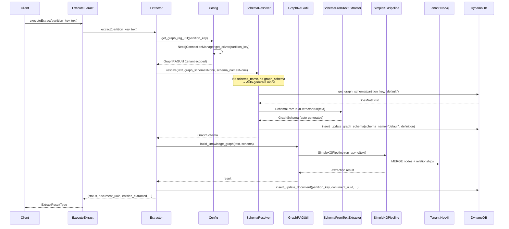
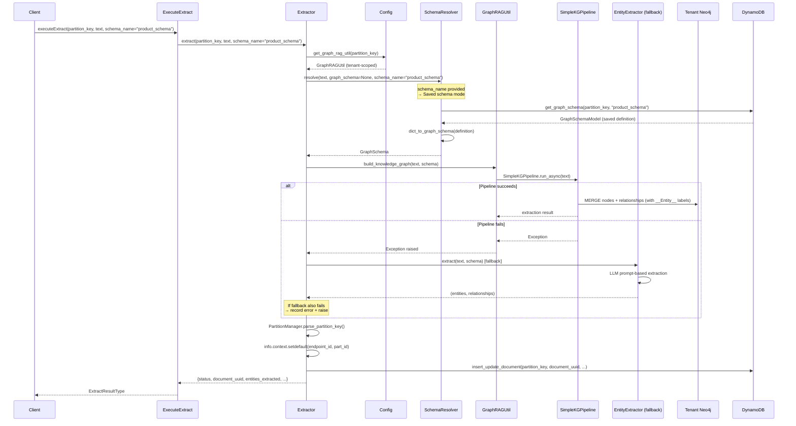
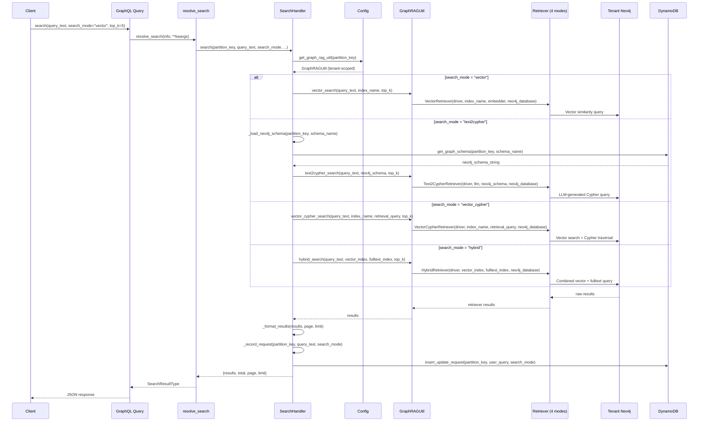
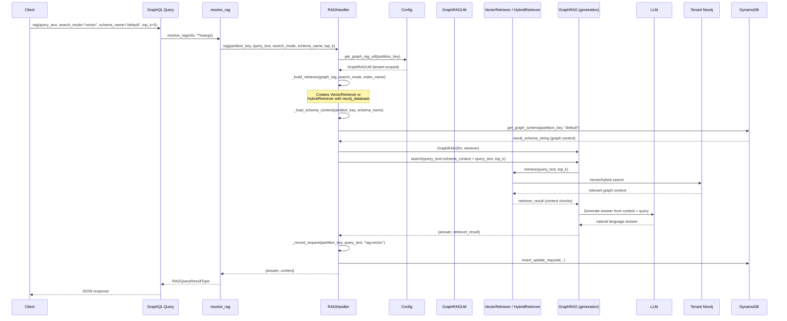

# Knowledge Graph Engine - Development Plan

## Executive Summary

Rebuild `ai_kg_engine` as `knowledge_graph_engine` with tenant-isolated Neo4j instances, flexible schema resolution, four search modes, and RAG capabilities. Each tenant operates with a dedicated Neo4j Community Edition instance keyed by `partition_key` (`{endpoint_id}#{part_id}`), eliminating cross-tenant data leakage. Module structure, patterns, and conventions are aligned with `ai_agent_core_engine`.

---

## Table of Contents

- [Architecture Overview](#architecture-overview)
- [Multi-Tenant Isolation Strategy](#multi-tenant-isolation-strategy)
- [Module Structure](#module-structure)
- [Phase 1: Runtime Foundation](#phase-1-runtime-foundation)
- [Phase 2: Data & Model Layer](#phase-2-data--model-layer)
- [Phase 3: Extraction Pipeline](#phase-3-extraction-pipeline)
- [Phase 4: Retrieval Layer](#phase-4-retrieval-layer)
- [Phase 5: Infrastructure Lifecycle](#phase-5-infrastructure-lifecycle)
- [Phase 6: Testing & Validation](#phase-6-testing--validation)
- [Current State & Gap Analysis](#current-state--gap-analysis)
- [Immediate Priorities](#immediate-priorities)
- [Risk Assessment](#risk-assessment)
- [Key Decisions Log](#key-decisions-log)

---

## Architecture Overview

```
                            GraphQL / Event Request
                                     |
                                     v
                    +------------------------------------+
                    |   KnowledgeGraphEngine (main.py)   |
                    |   _apply_partition_defaults()      |
                    |   partition_key = ep_id#part_id    |
                    +----------------+-------------------+
                                     |
              +----------------------+----------------------+
              |                      |                      |
              v                      v                      v
     +-----------------+   +-----------------+   +-----------------+
     |   Extraction    |   |     Search      |   |      RAG        |
     |   (Extractor)   |   | (SearchHandler) |   |  (RAGHandler)   |
     +---------+-------+   +--------+--------+   +--------+--------+
              |                      |                      |
              v                      v                      v
     +-----------------+   +-----------------+   +-----------------+
     | SchemaResolver  |   | GraphRAGUtil    |   | GraphRAGUtil    |
     | (5 modes)       |   | (4 search modes)|   | (GraphRAG)      |
     +---------+-------+   +--------+--------+   +--------+--------+
              |                      |                      |
              +----------------------+----------------------+
                                     |
                                     v
                    +------------------------------------+
                    | Neo4jConnectionManager             |
                    | Thread-safe driver pool per tenant  |
                    | Loads from DynamoDB registry        |
                    +----------------+-------------------+
                                     |
              +----------------------+----------------------+
              |                                             |
              v                                             v
     +-----------------+                           +-----------------+
     | Tenant Neo4j    |                           |    DynamoDB     |
     | (Community Ed.) |                           | kge-* tables   |
     | Isolated graphs |                           | Metadata store  |
     +-----------------+                           +-----------------+
```

**Isolation Guarantee**: Each `partition_key` maps to exactly one Neo4j instance. Schema introspection, labels, vector indexes, and data retrieval are strictly tenant-scoped.

---

## Multi-Tenant Isolation Strategy

### Why Instance-Per-Tenant

| Approach | Schema Isolation | Data Isolation | Limitation |
|----------|:---:|:---:|---|
| Single DB + property filter | None | Weak | `db.labels()` shows all tenants |
| Single DB + label partition | None | Moderate | Schema introspection leaks |
| Multi-database (Enterprise) | Per-database | Physical | Requires Enterprise Edition |
| **Instance-per-tenant** | **Complete** | **Physical** | **Free, containerized** |

### How It Works

```
partition_key "ep-001#part-a"  -->  bolt://neo4j-ep001-parta:7687
partition_key "ep-002#part-b"  -->  bolt://neo4j-ep002-partb:7687
```

- Each tenant's connection info is stored in DynamoDB (`kge-neo4j_instances`)
- `Neo4jConnectionManager` lazily creates and caches one `neo4j.Driver` per tenant
- `Config.get_graph_rag_util(partition_key)` returns a fully-scoped `GraphRAGUtil`
- No cross-tenant data leakage is physically possible

### Trade-offs

| Benefit | Trade-off | Mitigation |
|---------|-----------|------------|
| Complete schema isolation | More containers | Docker Compose / K8s |
| Clean vector indexes | ~256-512MB RAM each | Lazy start / idle shutdown |
| Text2Cypher sees correct schema | Connection pool per tenant | Driver caching in `Neo4jConnectionManager` |
| Independent backup/restore | Operational overhead | Automation via lifecycle management |

---

## Module Structure

```
knowledge_graph_engine/
├── __init__.py                 # Exports KnowledgeGraphEngine, deploy()
├── _compat.py                  # Stub modules when neo4j/neo4j-graphrag not installed
├── main.py                     # Engine class + deploy() + _apply_partition_defaults()
├── schema.py                   # GraphQL: type_class(), Query, Mutations
├── handlers/
│   ├── config.py               # Thread-safe Config singleton (aligned with aace)
│   ├── neo4j_connection_manager.py  # Driver pool, one per tenant
│   ├── partition_manager.py    # build/parse partition_key
│   ├── schema_resolver.py      # 5-mode schema resolution
│   ├── extractor.py            # KG extraction via SimpleKGPipeline
│   ├── search_handler.py       # 4-mode search dispatch
│   └── rag_handler.py          # RAG with configurable retriever
├── models/
│   ├── document.py             # kge-documents (hash: partition_key, range: document_uuid)
│   ├── graph_schema.py         # kge-graph_schemas (hash: partition_key, range: schema_name)
│   ├── data_source.py          # kge-data_sources (hash: partition_key, range: data_source_name)
│   ├── neo4j_instance.py       # kge-neo4j_instances (hash: partition_key, range: instance_id)
│   ├── request.py              # kge-requests (hash: partition_key, range: request_uuid)
│   ├── document_process_error.py  # kge-document_process_errors
│   ├── cache.py                # CascadingCachePurger
│   ├── utils.py                # initialize_tables()
│   └── batch_loaders/
│       ├── base.py             # SafeDataLoader
│       ├── document_loader.py
│       ├── graph_schema_loader.py
│       ├── data_source_loader.py
│       └── __init__.py         # RequestLoaders + get_loaders()
├── mutations/
│   ├── document.py             # InsertUpdateDocument, DeleteDocument
│   ├── graph_schema.py         # InsertUpdateGraphSchema, DeleteGraphSchema
│   ├── data_source.py          # InsertUpdateDataSource, DeleteDataSource
│   ├── neo4j_instance.py       # InsertUpdateNeo4jInstance, DeleteNeo4jInstance
│   └── extract.py              # ExecuteExtract
├── queries/
│   ├── document.py             # resolve_document, resolve_document_list
│   ├── graph_schema.py         # resolve_graph_schema, resolve_graph_schema_list
│   ├── data_source.py          # resolve_data_source, resolve_data_source_list
│   └── search.py               # resolve_search, resolve_rag
├── types/
│   ├── document.py             # DocumentType, DocumentListType
│   ├── graph_schema.py         # GraphSchemaType, GraphSchemaListType
│   ├── data_source.py          # DataSourceType, DataSourceListType
│   ├── neo4j_instance.py       # Neo4jInstanceType, Neo4jInstanceListType
│   ├── request.py              # RequestType, RequestListType
│   └── search.py               # SearchResultType, RAGQueryResultType, ExtractResultType
├── utils/
│   ├── graph_rag_util.py       # GraphRAGUtil (neo4j-graphrag-python wrapper)
│   ├── neo4j_writer.py         # CustomNeo4jWriter (KGWriter subclass)
│   ├── entity_extractor.py     # Fallback entity extraction
│   ├── normalization.py        # normalize_to_json()
│   ├── listener.py             # create_listener_info()
│   └── parse_file.py           # CSV/Excel parsing
└── tests/
    ├── conftest.py             # Fixtures: mock_info, mock_logger, partition_key
    ├── test_extract.py         # Extractor, SchemaResolver, PartitionManager, ConnectionManager
    ├── test_search.py          # Search and RAG resolution
    └── test_helpers.py         # Normalization, listener, file parsing
```

---

## Phase 1: Runtime Foundation

**Status**: COMPLETE

**What was built**:

| Component | Implementation | File |
|-----------|---------------|------|
| Engine class | `KnowledgeGraphEngine(Graphql)` with `_apply_partition_defaults()` | [main.py](../knowledge_graph_engine/main.py) |
| Deploy function | Returns list with GraphQL + async extraction functions | [main.py](../knowledge_graph_engine/main.py#L17-L45) |
| Config singleton | Thread-safe, lazy init, AWS services, cache config | [config.py](../knowledge_graph_engine/handlers/config.py) |
| Connection manager | `Neo4jConnectionManager` with per-tenant driver cache | [neo4j_connection_manager.py](../knowledge_graph_engine/handlers/neo4j_connection_manager.py) |
| Partition manager | `build_partition_key()`, `parse_partition_key()` | [partition_manager.py](../knowledge_graph_engine/handlers/partition_manager.py) |
| Compatibility layer | Stub modules for `neo4j` and `neo4j-graphrag` | [_compat.py](../knowledge_graph_engine/_compat.py) |
| GraphQL schema | `type_class()`, `Query`, `Mutations`, `build_graphql_schema()` | [schema.py](../knowledge_graph_engine/schema.py) |

**Key design decisions**:

- `partition_key` is enforced as required tenant boundary in `_apply_partition_defaults()` - raises `ValueError` if `endpoint_id` or `part_id` are missing
- `Config.get_graph_rag_util(partition_key)` is the single factory method: loads driver via `Neo4jConnectionManager`, reads `neo4j_database` from instance registry, returns scoped `GraphRAGUtil`
- `_compat.py` provides comprehensive stub modules so the package imports cleanly without `neo4j`/`neo4j-graphrag` installed (enables testing and lightweight deployments)

---

## Phase 2: Data & Model Layer

**Status**: COMPLETE (needs contract validation)

### DynamoDB Tables

All models use `partition_key` as hash key. Table prefix: `kge-`.

| Table | Hash Key | Range Key | Purpose |
|-------|----------|-----------|---------|
| `kge-documents` | `partition_key` | `document_uuid` | Extracted document metadata |
| `kge-graph_schemas` | `partition_key` | `schema_name` | Saved `GraphSchema` definitions |
| `kge-data_sources` | `partition_key` | `data_source_name` | Data source configurations |
| `kge-neo4j_instances` | `partition_key` | `instance_id` | Neo4j connection registry |
| `kge-requests` | `partition_key` | `request_uuid` | Query/search request log |
| `kge-document_process_errors` | `partition_key` | `process_error_uuid` | Extraction error tracking |

### Model Patterns (aligned with ai_agent_core_engine)

Each model file follows this pattern:

```python
# 1. Model class with PynamoDB attributes
class DocumentModel(BaseModel):
    class Meta(BaseModel.Meta):
        table_name = "kge-documents"
    partition_key = UnicodeAttribute(hash_key=True)
    document_uuid = UnicodeAttribute(range_key=True)
    # ... fields ...

# 2. Cached getter
@method_cache(ttl=Config.get_cache_ttl(), ...)
def get_document(partition_key, document_uuid):
    return DocumentModel.get(partition_key, document_uuid)

# 3. Count function (for decorator)
def get_document_count(partition_key, document_uuid):
    return DocumentModel.count(...)

# 4. Type converter
def get_document_type(info, document):
    return DocumentType(**normalize_to_json(document.__dict__["attribute_values"].copy()))

# 5. List resolver with decorator
@resolve_list_decorator(type_funct=get_document_type, loader_funct=get_document_count)
def resolve_document_list(info, **kwargs):
    # Build query args, return (inquiry_funct, count_funct, args)

# 6. Insert/update with decorator
@insert_update_decorator(keys={...}, model_funct=..., count_funct=..., type_funct=...)
def insert_update_document(info, **kwargs):
    # Create new or update existing

# 7. Delete with decorator
@delete_decorator(keys={...}, model_funct=...)
def delete_document(info, **kwargs):
    kwargs["entity"].delete()
```

### Batch Loaders

- `SafeDataLoader` base class swallows exceptions to prevent cascading failures
- `RequestLoaders` container holds all loaders, scoped per GraphQL request
- `get_loaders(context)` lazily initializes from `info.context`

### Cache Configuration

```python
# Config.CACHE_ENTITY_CONFIG maps each entity to its module, getter, and cache keys
# Config.CACHE_RELATIONSHIPS defines cascading purge dependencies:
CACHE_RELATIONSHIPS = {
    "document": ["request"],
    "graph_schema": ["document"],
    "data_source": ["document", "graph_schema"],
    "neo4j_instance": [],
}
```

---

## Phase 3: Extraction Pipeline

**Status**: IMPLEMENTED (needs end-to-end validation)

### neo4j-graphrag-python Integration

All extraction code uses the exact `neo4j-graphrag-python` API. Key imports:

```python
# Schema
from neo4j_graphrag.experimental.components.schema import (
    GraphSchema, NodeType, RelationshipType, PropertyType, Pattern,
    ConstraintType, SchemaBuilder, SchemaFromTextExtractor,
    SchemaFromExistingGraphExtractor,
)

# Pipeline
from neo4j_graphrag.experimental.pipeline.kg_builder import SimpleKGPipeline

# Writers
from neo4j_graphrag.experimental.components.kg_writer import KGWriter, KGWriterModel
from neo4j_graphrag.experimental.components.types import Neo4jGraph, LexicalGraphConfig

# LLMs (5 providers)
from neo4j_graphrag.llm import OpenAILLM, AnthropicLLM, OllamaLLM, VertexAILLM, MistralAILLM

# Embeddings
from neo4j_graphrag.embeddings import OpenAIEmbeddings
```

### Schema Resolution (5 modes)

`SchemaResolver` ([schema_resolver.py](../knowledge_graph_engine/handlers/schema_resolver.py)) resolves graph schema for extraction with this priority:

| Mode | Input | Resolution |
|------|-------|------------|
| **Saved** | `schema_name` only | Load `GraphSchema` from DynamoDB by name |
| **User-provided** | `graph_schema` dict | Convert to `GraphSchema` via `SchemaBuilder` |
| **String literal** | `"EXTRACTED"`, `"FREE"`, `"FROM_GRAPH"` | Pass to `SimpleKGPipeline` directly, or extract from existing graph |
| **Hybrid** | `graph_schema` dict with `auto_extend: true` | Merge user schema with LLM-discovered types |
| **Auto-generated** | Neither provided | `SchemaFromTextExtractor` generates, saves as "default" |

**Schema format** uses `neo4j-graphrag-python` native types (not custom dicts):

```python
GraphSchema(
    node_types=[
        NodeType(label="Company", properties=[
            PropertyType(name="name", type="STRING", required=True),
        ]),
    ],
    relationship_types=[
        RelationshipType(label="OWNS"),
    ],
    patterns=[
        ("Company", "OWNS", "Product"),
    ],
)
```

### Extraction Flow

```
ExecuteExtract mutation
  --> Extractor.extract(partition_key, text, graph_schema?, schema_name?)
    --> Config.get_graph_rag_util(partition_key)         # scoped to tenant
    --> SchemaResolver.resolve(text, graph_schema, schema_name)  # 5 modes
    --> GraphRAGUtil.build_knowledge_graph(text, schema)  # SimpleKGPipeline
        --> on failure: EntityExtractor fallback
    --> insert_update_document(...)                        # DynamoDB metadata
    --> return {status, document_uuid, entities_extracted, relationships_extracted}
```

### Sequence Diagram: Extraction Without Schema (Auto-Generate)

When no `graph_schema` or `schema_name` is provided, the engine auto-generates a schema from the input text using LLM, saves it for reuse, and then extracts.



### Sequence Diagram: Extraction With Schema

When a `graph_schema` dict or `schema_name` is provided, the engine resolves it directly without LLM auto-generation.



### Sequence Diagram: Search Query

The search flow dispatches to one of 4 retriever modes, all scoped to the tenant's Neo4j instance.



### Sequence Diagram: RAG Query

RAG combines retrieval with LLM generation for natural language answers grounded in the knowledge graph.



### GraphRAGUtil

[graph_rag_util.py](../knowledge_graph_engine/utils/graph_rag_util.py) wraps the `neo4j-graphrag-python` library for tenant-scoped operations:

- `__init__(driver, neo4j_database, settings)` - initializes LLM and embedder
- `build_knowledge_graph(text, schema)` - runs `SimpleKGPipeline` with async event loop handling
- `build_schema_from_text(text)` - auto-generates `GraphSchema` via `SchemaFromTextExtractor`
- `create_vector_index()` / `create_fulltext_index()` - manages tenant-scoped indexes
- All methods use `neo4j_database` parameter (not `database`) per library convention

### Custom KG Writer

[neo4j_writer.py](../knowledge_graph_engine/utils/neo4j_writer.py) - `CustomNeo4jWriter(KGWriter)`:

- Subclasses `KGWriter` abstract base class
- `async def run(graph: Neo4jGraph) -> KGWriterModel` - required API
- Uses APOC `merge.node()` for efficient batch MERGE with dynamic labels
- Distinguishes relation entities (MERGE only) from target entities (full UPSERT)

### Known Gaps

1. **Extraction not validated end-to-end** - pipeline logic exists but no integration test confirms actual Neo4j writes
2. **Async event loop handling** - `build_knowledge_graph()` uses `get_event_loop()` which can conflict in nested async contexts

---

## Phase 4: Retrieval Layer

**Status**: IMPLEMENTED

### Search (4 modes)

`SearchHandler` ([search_handler.py](../knowledge_graph_engine/handlers/search_handler.py)) delegates to `GraphRAGUtil`:

| Mode | Retriever | Use Case |
|------|-----------|----------|
| `vector` | `VectorRetriever` | Semantic similarity on embeddings |
| `text2cypher` | `Text2CypherRetriever` | LLM converts natural language to Cypher |
| `vector_cypher` | `VectorCypherRetriever` | Vector search + custom Cypher traversal |
| `hybrid` | `HybridRetriever` | Combined vector + fulltext search |

**GraphQL interface** ([schema.py](../knowledge_graph_engine/schema.py#L112-L117)):

```graphql
search(
  query_text: String!
  search_type: String       # "vector" | "text2cypher" | "vector_cypher" | "hybrid"
  schema_name: String       # Load tenant's schema for text2cypher
): SearchResultType
```

**Backward compatibility**: `search_type` is mapped to `search_mode` in [search.py](../knowledge_graph_engine/queries/search.py#L22-L23) resolver.

### RAG

`RAGHandler` ([rag_handler.py](../knowledge_graph_engine/handlers/rag_handler.py)) uses `GraphRAG` with configurable retriever:

- Builds `VectorRetriever` or `HybridRetriever` based on `search_mode`
- Loads schema context from DynamoDB to enrich RAG queries
- Supports custom prompt templates via `RagTemplate`
- All retrievers use `neo4j_database=graph_rag.neo4j_database`

### Search Result Types

```python
class SearchResultType(ObjectType):       # Search results with pagination
    results = List(JSONCamelCase)
    query = String()
    total = Int()
    page = Int()
    limit = Int()

class RAGQueryResultType(ObjectType):     # RAG response
    answer = String()
    sources = List(JSONCamelCase)
    context = List(JSONCamelCase)

class ExtractResultType(ObjectType):      # Extraction result
    status = String()
    partition_key = String()
    document_uuid = String()
    schema_name = String()
    entities_extracted = Int()
    relationships_extracted = Int()
    result = JSONCamelCase
```

### Known Gaps

1. **GraphQL search parameters incomplete** - `schema.py` exposes `search_type` and `schema_name`, but not `index_name`, `retrieval_query`, `top_k`, `filters` which `SearchHandler.search()` accepts
2. **RAG GraphQL parameters incomplete** - missing `search_mode`, `index_name`, `top_k`, `prompt` parameters in the GraphQL `rag` field

---

## Phase 5: Infrastructure Lifecycle

**Status**: PLANNED

### Tenant Onboarding

When a new tenant needs Neo4j:

1. **Pre-deployed**: Admin provisions Neo4j container, registers via `InsertUpdateNeo4jInstance` mutation
2. **Dynamic**: Engine provisions container via Docker API on first request
3. **Managed**: External Neo4j Aura instance, connection info registered in DynamoDB

### Tenant Decommissioning

```python
def decommission_tenant(partition_key):
    Neo4jConnectionManager.close_driver(partition_key)     # Close cached driver
    # Stop/remove Docker container (optional)
    delete_neo4j_instance(info, partition_key, "default")  # Remove registry entry
    # Clean up DynamoDB records for this partition
```

### Deployment Options

| Option | Best For | Complexity |
|--------|----------|:---:|
| Docker Compose | Development / small deployments | Low |
| Kubernetes StatefulSet | Production | Medium |
| Pre-registered (Aura) | Managed Neo4j | Low |
| Dynamic Docker API | Self-service onboarding | High |

### Outstanding Decisions

- [ ] Choose provisioning strategy for production
- [ ] Define idle shutdown policy (containers consuming RAM when unused)
- [ ] Define backup/restore procedures per tenant
- [ ] Health check and monitoring approach

---

## Phase 6: Testing & Validation

**Status**: PARTIAL

### Current Test Coverage

| Test File | What's Covered | Status |
|-----------|---------------|--------|
| [test_extract.py](../tests/test_extract.py) | Extractor init, validation, SchemaResolver dict conversion, PartitionManager, ConnectionManager cache | Unit |
| [test_search.py](../tests/test_search.py) | Vector search resolution, RAG resolution (mocked) | Unit |
| [test_helpers.py](../tests/test_helpers.py) | Normalization (Decimal, dict, None), listener info, CSV parsing | Unit |

### Missing Test Coverage

| Category | Priority | What's Needed |
|----------|:---:|---|
| **Multi-tenant isolation** | Critical | Verify data in tenant A invisible to tenant B |
| **End-to-end extraction** | Critical | Real text --> Neo4j graph --> verify nodes/relationships |
| **Schema persistence cycle** | High | Save schema --> load schema --> extract with loaded schema |
| **All 4 search modes** | High | Each mode against real Neo4j with test data |
| **RAG pipeline** | High | Full RAG flow: extract --> search --> generate answer |
| **Connection lifecycle** | Medium | Driver creation, caching, close, reconnect |
| **Error handling** | Medium | Extraction failures, missing Neo4j instance, invalid schema |
| **Cache invalidation** | Medium | Mutation triggers correct cascading purge |
| **Async extraction** | Medium | `async_extract_knowledge_graph` event handler |
| **Compatibility layer** | Low | Tests run with stub modules (no real neo4j) |

### Test Infrastructure Needed

```python
# conftest.py additions needed:
@pytest.fixture(scope="session")
def neo4j_driver():
    """Real Neo4j driver for integration tests."""
    driver = GraphDatabase.driver("bolt://localhost:7687", auth=("neo4j", "test"))
    yield driver
    driver.close()

@pytest.fixture
def tenant_graph_rag(neo4j_driver):
    """GraphRAGUtil scoped to test tenant."""
    return GraphRAGUtil(driver=neo4j_driver, neo4j_database="neo4j", settings={...})
```

---

## Current State & Gap Analysis

### Implementation Status

| Component | Code Exists | Unit Tests | Integration Tests | Production Ready |
|-----------|:---:|:---:|:---:|:---:|
| Config & initialization | Yes | No | No | Needs validation |
| Neo4jConnectionManager | Yes | Yes | No | Needs real Neo4j test |
| PartitionManager | Yes | Yes | - | Ready |
| SchemaResolver (5 modes) | Yes | Partial | No | Needs all modes tested |
| Extractor | Yes | Partial | No | Needs E2E validation |
| GraphRAGUtil | Yes | Partial | No | Needs real Neo4j test |
| CustomNeo4jWriter | Yes | No | No | Needs validation |
| SearchHandler (4 modes) | Yes | Partial | No | Needs real Neo4j test |
| RAGHandler | Yes | Partial | No | Needs real Neo4j test |
| DynamoDB models (6) | Yes | No | No | Needs CRUD validation |
| Batch loaders | Yes | No | No | Needs validation |
| Cache (CascadingCachePurger) | Yes | No | No | Needs validation |
| GraphQL schema | Yes | No | No | Needs contract check |
| Mutations (5) | Yes | No | No | Needs validation |
| Queries (4) | Yes | No | No | Needs validation |
| Types (6) | Yes | No | No | Needs shape alignment |
| Compatibility layer | Yes | Implicit | - | Working |
| Entity extractor (fallback) | Yes | No | No | Low priority |

### Code Quality Issues

1. **`queries/document.py` line 32-33**: `resolve_document_list` shadows the imported function of the same name - will cause infinite recursion:
   ```python
   def resolve_document_list(info, **kwargs):
       return resolve_document_list(info, **kwargs)  # calls itself!
   ```

2. **`models/request.py` line 35**: Still uses `is_similarity_search = BooleanAttribute(default=False)` instead of `search_mode`

3. **`schema.py` search field**: Exposes only `search_type` and `schema_name`, missing `index_name`, `retrieval_query`, `filters`, `top_k`, `page`, `limit` parameters that `SearchHandler.search()` accepts

4. **`schema.py` rag field**: Exposes only `query_text` and `schema_name`, missing `search_mode`, `index_name`, `top_k`, `prompt` parameters that `RAGHandler.rag()` accepts

5. **`ExtractResultType.result`**: Defined as `result = JSONCamelCase` (missing parentheses) - should be `result = Field(JSONCamelCase)` or `result = JSONCamelCase()`

6. **`schema.py` neo4j_instance resolver**: Imports `get_neo4j_instance_type` from `..models.neo4j_instance` - relative import path is wrong (should be `from .models.` when called from schema.py context)

### Contract Misalignment: GraphQL Schema vs Handler Parameters

| Field | GraphQL Parameters | Handler Accepts |
|-------|-------------------|-----------------|
| `search` | `query_text, search_type, schema_name` | `query_text, search_mode, schema_name, index_name, retrieval_query, filters, top_k, page, limit` |
| `rag` | `query_text, schema_name` | `query_text, search_mode, schema_name, index_name, top_k, prompt` |
| `execute_extract` | `partition_key, text, graph_schema, schema_name` | `partition_key, text, graph_schema, schema_name, document_source, document_external_id` |

---

## Immediate Priorities

### 1. Fix Code Quality Issues (Blocking)

- [ ] Fix `queries/document.py` recursive import bug
- [ ] Fix `ExtractResultType.result` field definition
- [ ] Fix `schema.py` neo4j_instance resolver import path
- [ ] Update `RequestModel.is_similarity_search` to `search_mode`

### 2. Align GraphQL Contract (High)

- [ ] Add missing search parameters to `schema.py` Query.search field
- [ ] Add missing RAG parameters to `schema.py` Query.rag field
- [ ] Add missing extract parameters to `ExecuteExtract.Arguments`
- [ ] Verify `SearchResultItemType` fields match `SearchHandler._format_results()` output

### 3. Integration Test Infrastructure (High)

- [ ] Set up Neo4j test fixture (Docker container or embedded)
- [ ] Set up DynamoDB local for model tests
- [ ] Write end-to-end extraction test: text -> Neo4j -> verify graph
- [ ] Write multi-tenant isolation test

### 4. Model & Cache Validation (Medium)

- [ ] Test all 6 model CRUD operations
- [ ] Validate cache invalidation cascading
- [ ] Test batch loaders with real data

### 5. Neo4j Provisioning Strategy Decision (Medium)

- [ ] Choose between Docker Compose / K8s / managed
- [ ] Prototype tenant provisioning flow
- [ ] Document operational procedures

---

## Risk Assessment

| Risk | Impact | Likelihood | Mitigation |
|------|:---:|:---:|---|
| `queries/document.py` recursive call in production | Critical | High | Fix immediately |
| Neo4j per-tenant RAM cost | High | Medium | Idle shutdown, resource quotas |
| Cross-tenant data leakage | Critical | Low | Instance-per-tenant architecture |
| GraphQL/handler contract drift | Medium | High | Automated contract tests |
| Connection pool exhaustion | High | Medium | Pool limits, monitoring, alerts |
| Async event loop conflicts | Medium | Medium | Standardize on single loop strategy |
| Schema drift after upgrades | Medium | Low | Schema versioning in DynamoDB |

---

## Key Differences from ai_kg_engine

| Aspect | ai_kg_engine | knowledge_graph_engine |
|--------|:---|:---|
| Tenant key | `endpoint_id` only | `partition_key` = `endpoint_id#part_id` |
| Neo4j isolation | Single shared database | Instance-per-tenant (Community Edition) |
| Schema mode | Hardcoded `"EXTRACTED"` | 5 modes: saved, user, auto, hybrid, from-graph |
| Search modes | 3 (vector, text2cypher, vector_cypher) | 4 (+ hybrid) |
| Config pattern | Simple class vars | Thread-safe singleton with cache (aace) |
| Model decorators | None | `@insert_update_decorator`, `@delete_decorator` |
| Batch loaders | None | `SafeDataLoader` + `RequestLoaders` |
| Cache | None | `@method_cache` + cascading invalidation |
| Deploy format | Single dict | List of dicts (aace pattern) |
| Mutations | Single `Extract` class | `InsertUpdate{Entity}` / `Delete{Entity}` pairs |
| Compatibility | Hard dependency on neo4j | Stub modules for lightweight imports |
| Error handling | `print()` statements | Structured logging + error model |

---

## Key Decisions Log

| Date | Decision | Rationale | Status |
|------|----------|-----------|--------|
| 2025-Q4 | Instance-per-tenant Neo4j | Label partitioning leaks schema via `db.labels()` | Active |
| 2025-Q4 | neo4j-graphrag-python library | Standardized API for KG operations | Active |
| 2025-Q4 | 5-mode schema resolution | Flexibility: auto, user, hybrid, saved, from-graph | Active |
| TBD | Neo4j provisioning strategy | Docker vs K8s vs managed | Pending |
| TBD | Cache invalidation rules | Real query pattern validation needed | Pending |
| TBD | `search_type` deprecation | Transition to `search_mode` naming | Pending |

---

## Naming Conventions (aligned with ai_agent_core_engine)

| Convention | Pattern | Example |
|-----------|---------|---------|
| Module exports | `__all__ = ["Engine", "deploy"]` | `KnowledgeGraphEngine, deploy` |
| Engine class | `{Name}Engine(Graphql)` | `KnowledgeGraphEngine` |
| Deploy | `def deploy() -> list` | Returns list of service dicts |
| DynamoDB table | `kge-{entity_plural}` | `kge-documents` |
| Model class | `{Entity}Model` | `DocumentModel` |
| GraphQL type | `{Entity}Type`, `{Entity}ListType` | `DocumentType` |
| Mutation class | `InsertUpdate{Entity}`, `Delete{Entity}` | `InsertUpdateDocument` |
| Query resolver | `resolve_{entity}`, `resolve_{entity}_list` | `resolve_document` |
| Model CRUD | `get_{entity}`, `insert_update_{entity}`, `delete_{entity}` | `get_document` |
| DataLoader | `{Entity}Loader` | `DocumentLoader` |
| Cache key | `knowledge_graph_engine.{module}.{entity}` | `knowledge_graph_engine.models.document` |
| Partition key | `{endpoint_id}#{part_id}` | `"aws-prod#acme-corp"` |

---

*Last Updated: 2026-03-25*
