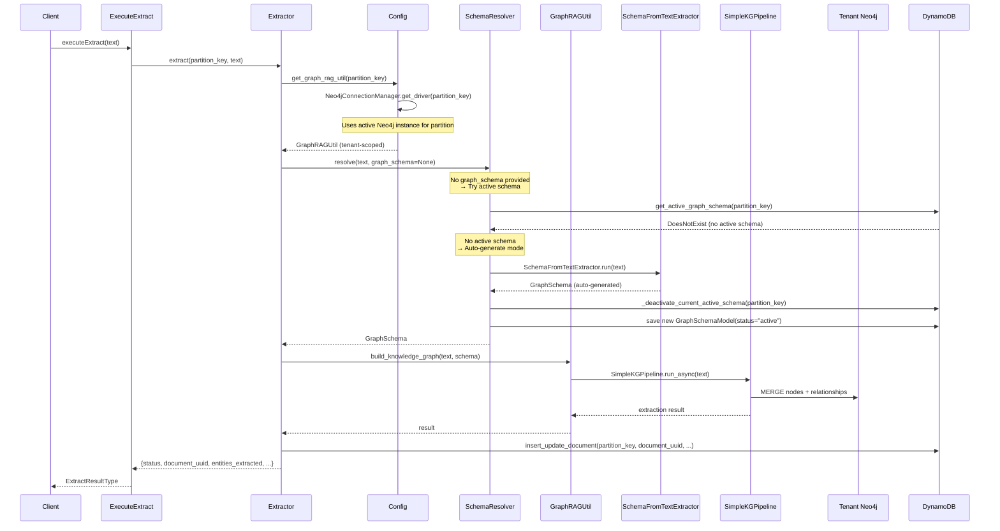
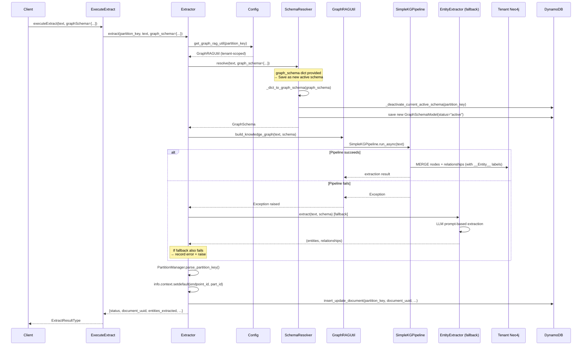
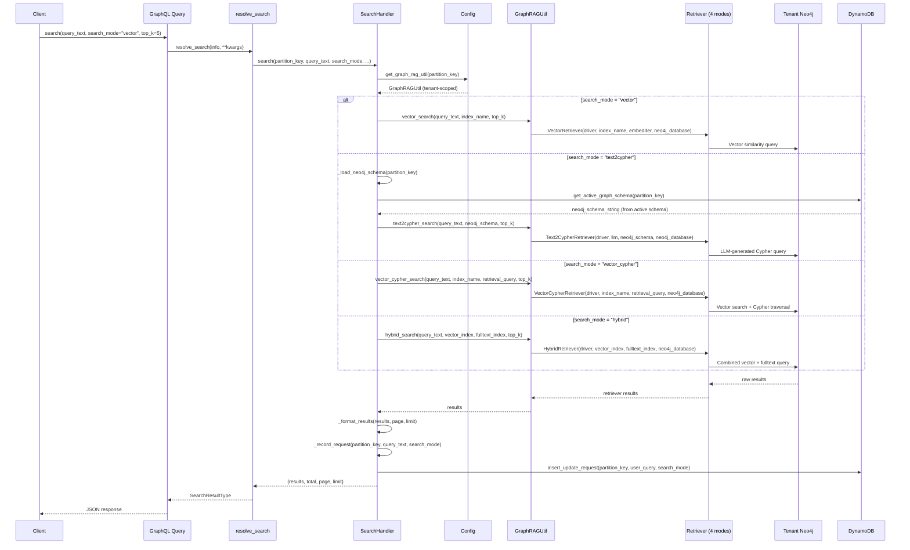
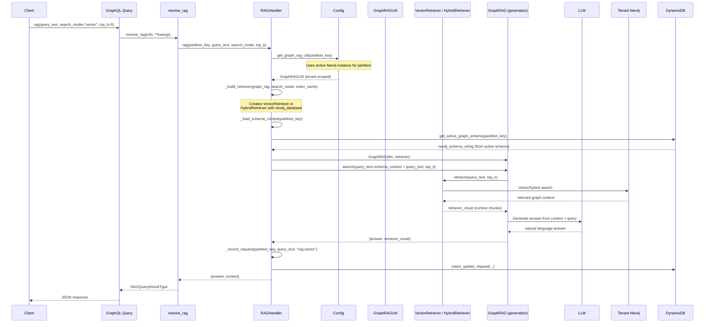

# Knowledge Graph Engine - Development Plan

## Executive Summary

Rebuild `ai_kg_engine` as `knowledge_graph_engine` with tenant-isolated Neo4j instances, flexible schema resolution, four search modes, and RAG capabilities. Each tenant operates with a dedicated Neo4j Community Edition instance keyed by `partition_key` (`{endpoint_id}#{part_id}`), eliminating cross-tenant data leakage. Module structure, patterns, and conventions are aligned with `ai_agent_core_engine`.

---

## Table of Contents

- [Architecture Overview](#architecture-overview)
- [Multi-Tenant Isolation Strategy](#multi-tenant-isolation-strategy)
- [Module Structure](#module-structure)
- [Phase 1: Runtime Foundation](#phase-1-runtime-foundation)
- [Phase 2: Data & Model Layer](#phase-2-data--model-layer)
- [Phase 3: Extraction Pipeline](#phase-3-extraction-pipeline)
- [Phase 4: Retrieval Layer](#phase-4-retrieval-layer)
- [Phase 5: Infrastructure Lifecycle](#phase-5-infrastructure-lifecycle)
- [Phase 6: Testing & Validation](#phase-6-testing--validation)
- [Current State & Gap Analysis](#current-state--gap-analysis)
- [Immediate Priorities](#immediate-priorities)
- [Risk Assessment](#risk-assessment)
- [Key Decisions Log](#key-decisions-log)

---

## Architecture Overview

```
                            GraphQL / Event Request
                                     |
                                     v
                    +------------------------------------+
                    |   KnowledgeGraphEngine (main.py)   |
                    |   _apply_partition_defaults()      |
                    |   partition_key = ep_id#part_id    |
                    +----------------+-------------------+
                                     |
              +----------------------+----------------------+
              |                      |                      |
              v                      v                      v
     +-----------------+   +-----------------+   +-----------------+
     |   Extraction    |   |     Search      |   |      RAG        |
     |   (Extractor)   |   | (SearchHandler) |   |  (RAGHandler)   |
     +---------+-------+   +--------+--------+   +--------+--------+
              |                      |                      |
              v                      v                      v
     +-----------------+   +-----------------+   +-----------------+
     | SchemaResolver  |   | GraphRAGUtil    |   | GraphRAGUtil    |
     | (active-only)   |   | (4 search modes)|   | (GraphRAG)      |
     +---------+-------+   +--------+--------+   +--------+--------+
              |                      |                      |
              +----------------------+----------------------+
                                     |
                                     v
                    +------------------------------------+
                    | Neo4jConnectionManager             |
                    | Thread-safe driver pool per tenant  |
                    | Loads from DynamoDB registry        |
                    +----------------+-------------------+
                                     |
              +----------------------+----------------------+
              |                                             |
              v                                             v
     +-----------------+                           +-----------------+
     | Tenant Neo4j    |                           |    DynamoDB     |
     | (Community Ed.) |                           | kge-* tables   |
     | Isolated graphs |                           | Metadata store  |
     +-----------------+                           +-----------------+
```

**Isolation Guarantee**: Each `partition_key` maps to exactly one Neo4j instance. Schema introspection, labels, vector indexes, and data retrieval are strictly tenant-scoped.

---

## Multi-Tenant Isolation Strategy

### Why Instance-Per-Tenant

| Approach | Schema Isolation | Data Isolation | Limitation |
|----------|:---:|:---:|---|
| Single DB + property filter | None | Weak | `db.labels()` shows all tenants |
| Single DB + label partition | None | Moderate | Schema introspection leaks |
| Multi-database (Enterprise) | Per-database | Physical | Requires Enterprise Edition |
| **Instance-per-tenant** | **Complete** | **Physical** | **Free, containerized** |

### How It Works

```
partition_key "ep-001#part-a"  -->  bolt://neo4j-ep001-parta:7687
partition_key "ep-002#part-b"  -->  bolt://neo4j-ep002-partb:7687
```

- Each tenant's connection info is stored in DynamoDB (`kge-neo4j_instances`)
- `Neo4jConnectionManager` lazily creates and caches one `neo4j.Driver` per tenant
- `Config.get_graph_rag_util(partition_key)` returns a fully-scoped `GraphRAGUtil`
- No cross-tenant data leakage is physically possible

### Trade-offs

| Benefit | Trade-off | Mitigation |
|---------|-----------|------------|
| Complete schema isolation | More containers | Docker Compose / K8s |
| Clean vector indexes | ~256-512MB RAM each | Lazy start / idle shutdown |
| Text2Cypher sees correct schema | Connection pool per tenant | Driver caching in `Neo4jConnectionManager` |
| Independent backup/restore | Operational overhead | Automation via lifecycle management |

---

## Module Structure

```
knowledge_graph_engine/
├── __init__.py                 # Exports KnowledgeGraphEngine, deploy()
├── __main__.py                 # python -m knowledge_graph_engine entry point
├── _compat.py                  # Stub modules when neo4j/neo4j-graphrag not installed
├── main.py                     # Engine class + daemon() + deploy() + main()
├── handlers/
│   ├── schema.py               # GraphQL: type_class(), Query, Mutations
│   ├── config.py               # Thread-safe Config singleton (aligned with aace)
│   ├── neo4j_connection_manager.py  # Driver pool, one per tenant
│   ├── partition_manager.py    # build/parse partition_key
│   ├── schema_resolver.py      # Schema resolution + two-phase evolution (text match → LLM)
│   ├── extractor.py            # KG extraction via SimpleKGPipeline + post-extraction evolution
│   ├── search_handler.py       # 4-mode search dispatch (with result_formatter toggle)
│   ├── rag_handler.py          # RAG with configurable retriever
│   ├── fastapi_app.py          # FastAPI app for daemon mode + background extract endpoint
│   ├── auth_router.py          # JWT auth endpoints (login, me)
│   ├── jwt_local.py            # Local JWT auth provider
│   ├── jwt_cognito.py          # Cognito JWT auth provider
│   └── middleware.py           # FlexJWTMiddleware for daemon auth
├── models/
│   ├── document.py             # kge-documents (hash: partition_key, range: document_uuid)
│   ├── graph_schema.py         # kge-graph_schemas (hash: partition_key, range: schema_name)
│   ├── neo4j_instance.py       # kge-neo4j_instances (hash: partition_key, range: instance_id)
│   ├── request.py              # kge-requests (hash: partition_key, range: request_uuid)
│   ├── document_process_error.py  # kge-document_process_errors
│   ├── cache.py                # CascadingCachePurger
│   ├── utils.py                # initialize_tables()
│   └── batch_loaders/
│       ├── base.py             # SafeDataLoader
│       ├── document_loader.py
│       ├── graph_schema_loader.py
│       └── __init__.py         # RequestLoaders + get_loaders()
├── mutations/
│   ├── document.py             # InsertUpdateDocument, DeleteDocument
│   ├── graph_schema.py         # InsertUpdateGraphSchema, DeleteGraphSchema
│   ├── neo4j_instance.py       # InsertUpdateNeo4jInstance, DeleteNeo4jInstance
│   └── extract.py              # ExecuteExtract
├── queries/
│   ├── document.py             # resolve_document, resolve_document_list
│   ├── graph_schema.py         # resolve_graph_schema, resolve_graph_schema_list
│   └── search.py               # resolve_search, resolve_rag
├── types/
│   ├── document.py             # DocumentType, DocumentListType
│   ├── graph_schema.py         # GraphSchemaType, GraphSchemaListType
│   ├── neo4j_instance.py       # Neo4jInstanceType, Neo4jInstanceListType
│   ├── request.py              # RequestType, RequestListType
│   ├── document_process_error.py  # DocumentProcessErrorType
│   └── search.py               # SearchResultType, RAGQueryResultType, ExtractResultType
├── utils/
│   ├── graph_rag_util.py       # GraphRAGUtil (neo4j-graphrag-python wrapper) + default_record_formatter
│   ├── neo4j_writer.py         # CustomNeo4jWriter (KGWriter subclass)
│   ├── entity_extractor.py     # Fallback entity extraction
│   ├── normalization.py        # normalize_to_json()
│   ├── listener.py             # create_listener_info()
│   └── parse_file.py           # CSV/Excel parsing
└── tests/
    ├── conftest.py             # Fixtures: mock_info, mock_logger, partition_key, engine
    ├── .env / .env.example     # Test environment configuration
    ├── launch_daemon.py        # Local daemon launcher script
    ├── test_extract.py         # Extractor unit tests
    ├── test_search.py          # Search and RAG resolution (unit, mocked)
    ├── test_helpers.py         # Normalization, listener, file parsing
    ├── test_import.py          # Smoke tests for package imports
    ├── test_module_hardening.py     # Filter composition, tiebreakers, UUID gen, config reinit
    ├── test_integration.py     # Engine init, table existence, ping (integration)
    ├── test_daemon.py          # FastAPI daemon tests
    ├── test_schema_evolution_live.py  # Schema evolution against real DynamoDB/Neo4j
    ├── test_search_rag.py      # End-to-end search/RAG queries (integration)
    └── test_woocommerce_extract.py    # WooCommerce-driven extraction (integration)
```

**Note**: `data_source` was dropped from scope — replaced by `document_source` field on `DocumentModel` (free-form string, no separate registry).

---

## Phase 1: Runtime Foundation

**Status**: COMPLETE

**What was built**:

| Component | Implementation | File |
|-----------|---------------|------|
| Engine class | `KnowledgeGraphEngine(Graphql)` with `_apply_partition_defaults()` + `daemon()` | [main.py](../knowledge_graph_engine/main.py) |
| Daemon mode | `engine.daemon()` starts uvicorn with JWT auth (matching `ai_mcp_daemon_engine`) | [main.py](../knowledge_graph_engine/main.py) |
| Deploy function | Returns list with GraphQL + async extraction functions | [main.py](../knowledge_graph_engine/main.py#L17-L45) |
| Config singleton | Thread-safe, lazy init, AWS services, cache config | [config.py](../knowledge_graph_engine/handlers/config.py) |
| Connection manager | `Neo4jConnectionManager` with per-tenant driver cache, uses active instance | [neo4j_connection_manager.py](../knowledge_graph_engine/handlers/neo4j_connection_manager.py) |
| Partition manager | `build_partition_key()`, `parse_partition_key()` | [partition_manager.py](../knowledge_graph_engine/handlers/partition_manager.py) |
| Compatibility layer | Stub modules for `neo4j`, `neo4j-graphrag`, `silvaengine_dynamodb_base`, `silvaengine_utility` (including `Graphql`) | [_compat.py](../knowledge_graph_engine/_compat.py) |
| GraphQL schema | `type_class()`, `Query`, `Mutations`, `build_graphql_schema()` | [schema.py](../knowledge_graph_engine/handlers/schema.py) |
| FastAPI app | FastAPI app with thread-pool execution, background extract endpoint | [fastapi_app.py](../knowledge_graph_engine/handlers/fastapi_app.py) |
| Auth router | JWT login/me endpoints (local + Cognito) | [auth_router.py](../knowledge_graph_engine/handlers/auth_router.py) |

**Key design decisions**:

- `partition_key` is enforced as required tenant boundary in `_apply_partition_defaults()` - raises `ValueError` if `endpoint_id` or `part_id` are missing
- `Config.get_graph_rag_util(partition_key)` is the single factory method: loads driver via `Neo4jConnectionManager`, reads `neo4j_database` from instance registry, returns scoped `GraphRAGUtil`
- `_compat.py` provides comprehensive stub modules so the package imports cleanly without `neo4j`/`neo4j-graphrag`/`silvaengine_dynamodb_base`/`silvaengine_utility` installed (enables testing and lightweight deployments). The `Graphql` base class stub supports `main.py`'s `KnowledgeGraphEngine(Graphql)` inheritance.
- `Config.get_graph_rag_util(partition_key)` caches `GraphRAGUtil` instances per partition. Cache is invalidated via `clear_graph_rag_util()` when the active Neo4j instance changes.
- `Config.reset()` supports re-initialization with different settings (e.g. test isolation). Closes all Neo4j drivers and clears cached utilities.

---

## Phase 2: Data & Model Layer

**Status**: COMPLETE (needs contract validation)

### DynamoDB Tables

All models use `partition_key` as hash key. Table prefix: `kge-`.

| Table | Hash Key | Range Key | Purpose |
|-------|----------|-----------|---------|
| `kge-documents` | `partition_key` | `document_uuid` | Extracted document metadata |
| `kge-graph_schemas` | `partition_key` | `schema_name` | Saved `GraphSchema` definitions |
| `kge-data_sources` | `partition_key` | `data_source_name` | Data source configurations |
| `kge-neo4j_instances` | `partition_key` | `instance_id` | Neo4j connection registry |
| `kge-requests` | `partition_key` | `request_uuid` | Query/search request log |
| `kge-document_process_errors` | `partition_key` | `process_error_uuid` | Extraction error tracking |

### Model Patterns (aligned with ai_agent_core_engine)

Each model file follows this pattern:

```python
# 1. Model class with PynamoDB attributes
class DocumentModel(BaseModel):
    class Meta(BaseModel.Meta):
        table_name = "kge-documents"
    partition_key = UnicodeAttribute(hash_key=True)
    document_uuid = UnicodeAttribute(range_key=True)
    # ... fields ...

# 2. Cached getter
@method_cache(ttl=Config.get_cache_ttl(), ...)
def get_document(partition_key, document_uuid):
    return DocumentModel.get(partition_key, document_uuid)

# 3. Count function (for decorator)
def get_document_count(partition_key, document_uuid):
    return DocumentModel.count(...)

# 4. Type converter
def get_document_type(info, document):
    return DocumentType(**normalize_to_json(document.__dict__["attribute_values"].copy()))

# 5. List resolver with decorator
@resolve_list_decorator(type_funct=get_document_type, loader_funct=get_document_count)
def resolve_document_list(info, **kwargs):
    # Build query args, return (inquiry_funct, count_funct, args)

# 6. Insert/update with decorator
@insert_update_decorator(keys={...}, model_funct=..., count_funct=..., type_funct=...)
def insert_update_document(info, **kwargs):
    # Create new or update existing

# 7. Delete with decorator
@delete_decorator(keys={...}, model_funct=...)
def delete_document(info, **kwargs):
    kwargs["entity"].delete()
```

### Batch Loaders

- `SafeDataLoader` base class swallows exceptions to prevent cascading failures
- `RequestLoaders` container holds all loaders, scoped per GraphQL request
- `get_loaders(context)` lazily initializes from `info.context`

### Cache Configuration

```python
# Config.CACHE_ENTITY_CONFIG maps each entity to its module, getter, and cache keys
# list_resolver paths point to model modules (not queries/) for neo4j_instance and request
# Config.CACHE_RELATIONSHIPS defines cascading purge dependencies (plain strings):
CACHE_RELATIONSHIPS = {
    "document": ["request"],
    "graph_schema": ["document"],
    "neo4j_instance": [],
}
# CascadingCachePurger handles both string and dict entries in the children list
```

---

## Phase 3: Extraction Pipeline

**Status**: IMPLEMENTED + VALIDATED with live data (schema evolution proven end-to-end)

### neo4j-graphrag-python Integration

All extraction code uses the exact `neo4j-graphrag-python` API. Key imports:

```python
# Schema
from neo4j_graphrag.experimental.components.schema import (
    GraphSchema, NodeType, RelationshipType, PropertyType, Pattern,
    ConstraintType, SchemaBuilder, SchemaFromTextExtractor,
    SchemaFromExistingGraphExtractor,
)

# Pipeline
from neo4j_graphrag.experimental.pipeline.kg_builder import SimpleKGPipeline

# Writers
from neo4j_graphrag.experimental.components.kg_writer import KGWriter, KGWriterModel
from neo4j_graphrag.experimental.components.types import Neo4jGraph, LexicalGraphConfig

# LLMs (5 providers)
from neo4j_graphrag.llm import OpenAILLM, AnthropicLLM, OllamaLLM, VertexAILLM, MistralAILLM

# Embeddings
from neo4j_graphrag.embeddings import OpenAIEmbeddings
```

### Schema Resolution + Evolution (Active-Only Pattern)

`SchemaResolver` ([schema_resolver.py](../knowledge_graph_engine/handlers/schema_resolver.py)) resolves graph schema for extraction AND evolves it post-extraction. Only one schema per partition can be active at a time. The system always uses the active schema unless a `graph_schema` dict is provided in the extract call.

**Resolution priority (before extraction):**

| Priority | Input | Resolution |
|:---:|-------|------------|
| 1 | `graph_schema` dict provided | Convert to `GraphSchema`, **save as new active** (deactivates old active) |
| 2 | `graph_schema` dict with `auto_extend: true` | Merge with LLM-discovered types, **save as new active** |
| 3 | `graph_schema` string (`"EXTRACTED"`, `"FREE"`, `"FROM_GRAPH"`) | Pass to `SimpleKGPipeline` directly |
| 4 | No `graph_schema` provided, active schema exists | Two-phase coverage check (see below) |
| 5 | No active schema exists | Return `"EXTRACTED"` — let `SimpleKGPipeline` extract freely; schema is captured post-extraction |

**Two-phase coverage check (resolve when active schema exists):**

The resolver avoids LLM calls for records the active schema already covers:

- **Phase 1 (free)**: Check if any of the active schema's node labels appear in the text (case-insensitive substring match). If yes → return the active schema unchanged. This catches ~100% of in-domain records in observed product data.
- **Phase 2 (LLM)**: If no labels match, ask the LLM (`SchemaFromTextExtractor`) what entity types the text needs. If new types are found, build a new schema version on top of the active one and **save as new active** (superset). If no new types, reuse the active schema.

**Post-extraction evolution (`evolve_schema_from_graph(text)`):**

Called after every successful extraction:

1. Try to read schema from the live graph via `SchemaFromExistingGraphExtractor` (requires APOC).
2. **APOC fallback**: If APOC isn't installed, fall back to LLM discovery from the extracted `text`.
3. If no active schema exists → save the discovered schema as the first active version (`captured`).
4. If active schema exists and graph has new types → merge as superset, deactivate old, save new as active (`evolved`).
5. If active schema already covers graph → no-op.

**Active-only enforcement:**
- `schema_name` is **not** exposed as a parameter in extract, search, or RAG operations
- All operations use the active schema for the partition automatically
- `schema_name` only appears in the Graph Schema CRUD mutations/queries (it's the DynamoDB range key for managing schemas)
- When a new schema is inserted or an old one is activated via `insertUpdateGraphSchema`, the previously active schema is automatically deactivated
- **Old versions are deactivated, not deleted** — full version history is preserved in DynamoDB

**Validation (2026-03-30, see `test_schema_evolution_live.py`):**
- 5 documents (snowboard products) from `kge-documents` for partition `gpt#nestaging`
- First record (no active schema) → LLM discovered `Product, Category, Tag, Vendor` + 4 relationships, saved as `captured_*`
- 20 subsequent product records → **100% Phase 1 hit rate** (zero LLM calls), reused active schema
- Novel text (synthetic space-domain) → Phase 2 fired, schema evolved 4→9 nodes, 4→7 rels as superset, old version deactivated, new version `evolved_*` saved as active

**Schema format** uses `neo4j-graphrag-python` native types (not custom dicts):

```python
GraphSchema(
    node_types=[
        NodeType(label="Company", properties=[
            PropertyType(name="name", type="STRING", required=True),
        ]),
    ],
    relationship_types=[
        RelationshipType(label="OWNS"),
    ],
    patterns=[
        ("Company", "OWNS", "Product"),
    ],
)
```

### Extraction Flow

Two entry points are available:

| Entry Point | Mode | Use Case |
|---|---|---|
| `executeExtract` GraphQL mutation | Synchronous (runs in thread pool) | Single document, waits for result |
| `POST /{endpoint_id}/extract` REST | Background (fire-and-forget) | Batch pipelines (Dagster, Airflow) |

**Synchronous flow (GraphQL)**:

```
ExecuteExtract mutation
  --> Extractor.extract(partition_key, text, graph_schema?)
    --> Config.get_graph_rag_util(partition_key)         # scoped to tenant (active instance)
    --> SchemaResolver.resolve(text, graph_schema)        # active schema or provided dict
    --> GraphRAGUtil.build_knowledge_graph(text, schema)  # SimpleKGPipeline
        --> on failure: EntityExtractor fallback
    --> insert_update_document(...)                        # DynamoDB metadata
    --> return {status, document_uuid, entities_extracted, relationships_extracted}
```

**Background flow (REST)**:

```
POST /{endpoint_id}/extract  {text, graph_schema?, document_source?, document_external_id?}
  --> Returns immediately: {task_id, status: "pending"}
  --> ThreadPoolExecutor runs Extractor.extract() in background
  --> Poll: GET /{endpoint_id}/extract/{task_id}
      --> {status: "running", elapsed_seconds: 45.2}
      --> {status: "completed", result: {...}}
      --> {status: "failed", error: "..."}
```

Worker concurrency is controlled by `KGE_EXTRACT_WORKERS` env var (default: 4). Tune based on LLM API rate limits — the LLM is the bottleneck, not compute.

### Sequence Diagram: Extraction Without Schema (Auto-Generate)

When no `graph_schema` is provided and no active schema exists, the engine auto-generates a schema from the input text using LLM, saves it as the new active schema, and then extracts.



### Sequence Diagram: Extraction With Schema (graph_schema dict)

When a `graph_schema` dict is provided, it becomes the new active schema (deactivating the old one) and is used for extraction.



### Sequence Diagram: Search Query

The search flow dispatches to one of 4 retriever modes, all scoped to the tenant's Neo4j instance.



### Sequence Diagram: RAG Query

RAG combines retrieval with LLM generation for natural language answers grounded in the knowledge graph.



### GraphRAGUtil

[graph_rag_util.py](../knowledge_graph_engine/utils/graph_rag_util.py) wraps the `neo4j-graphrag-python` library for tenant-scoped operations:

- `__init__(driver, neo4j_database, settings)` - initializes LLM and embedder
- `build_knowledge_graph(text, schema)` - runs `SimpleKGPipeline` with async event loop handling
- `build_schema_from_text(text)` - auto-generates `GraphSchema` via `SchemaFromTextExtractor`
- `create_vector_index()` / `create_fulltext_index()` - manages tenant-scoped indexes
- All methods use `neo4j_database` parameter (not `database`) per library convention

### Custom KG Writer

[neo4j_writer.py](../knowledge_graph_engine/utils/neo4j_writer.py) - `CustomNeo4jWriter(KGWriter)`:

- Subclasses `KGWriter` abstract base class
- `async def run(graph: Neo4jGraph) -> KGWriterModel` - required API
- Uses APOC `merge.node()` for efficient batch MERGE with dynamic labels
- Distinguishes relation entities (MERGE only) from target entities (full UPSERT)

### Known Gaps

1. ~~**Extraction not validated end-to-end**~~ **VALIDATED**: WooCommerce-driven extraction tests (`test_woocommerce_extract.py`) and live schema evolution tests (`test_schema_evolution_live.py`) confirm real Neo4j writes and post-extraction schema capture against partition `gpt#nestaging`.
2. ~~**Async event loop handling**~~ **FIXED**: `nest_asyncio.apply()` + `_run_async()` helper handles nested event loops. `_SuppressEventLoopClosedFilter` suppresses harmless httpx cleanup noise. GraphQL handler runs in `ThreadPoolExecutor` to avoid blocking FastAPI's event loop.
3. **Vector index creation is manual** - `create_vector_index()` exists on `GraphRAGUtil` but is not called automatically after first extraction. Operators must create the `vector` index on `Chunk(embedding)` once per Neo4j instance, or search returns `"No index with name vector found"`. Consider auto-creation hook on first extract.
4. **APOC requirement for graph schema read** - `SchemaFromExistingGraphExtractor` requires `apoc.meta.data()`. On instances without APOC, the engine automatically falls back to LLM-based discovery from the extraction text. Production Neo4j instances should install APOC for cheaper, deterministic schema reads.

---

## Phase 4: Retrieval Layer

**Status**: IMPLEMENTED

### Search (4 modes)

`SearchHandler` ([search_handler.py](../knowledge_graph_engine/handlers/search_handler.py)) delegates to `GraphRAGUtil`:

| Mode | Retriever | Use Case |
|------|-----------|----------|
| `vector` | `VectorRetriever` | Semantic similarity on embeddings |
| `text2cypher` | `Text2CypherRetriever` | LLM converts natural language to Cypher |
| `vector_cypher` | `VectorCypherRetriever` | Vector search + custom Cypher traversal |
| `hybrid` | `HybridRetriever` | Combined vector + fulltext search |

**Result formatting**: All 4 modes now accept `is_result_formatter` (default `True`). When enabled, `GraphRAGUtil.default_record_formatter()` flattens Neo4j `Node`/`Relationship` objects into structured dicts with `element_id`, `label`/`type`, and `properties` — stripping any `*embedding*` properties to keep payloads small. Set `is_result_formatter=False` to receive raw retriever results.

**vector_cypher default query**: Updated to `MATCH (node)<-[:FROM_CHUNK]-(rel_node) RETURN rel_node, score` — returns the entity nodes linked to matching chunks, not the chunks themselves.

**GraphQL interface** ([schema.py](../knowledge_graph_engine/handlers/schema.py)):

```graphql
search(
  query_text: String!
  search_mode: String       # "vector" | "text2cypher" | "vector_cypher" | "hybrid"
  index_name: String        # Vector index name (default: "vector")
  retrieval_query: String   # Custom Cypher for vector_cypher mode
  filters: JSONCamelCase    # Additional filters
  top_k: Int                # Number of results
  page: Int
  limit: Int
): SearchResultType
```

The active schema is automatically used for text2cypher mode — no `schema_name` parameter needed.

**Backward compatibility**: `search_type` is mapped to `search_mode` in [search.py](../knowledge_graph_engine/queries/search.py#L22-L23) resolver.

### RAG

`RAGHandler` ([rag_handler.py](../knowledge_graph_engine/handlers/rag_handler.py)) uses `GraphRAG` with configurable retriever:

- Builds `VectorRetriever` or `HybridRetriever` based on `search_mode`
- Automatically loads the **active schema** context to enrich RAG queries
- Supports custom prompt templates via `RagTemplate`
- All retrievers use `neo4j_database=graph_rag.neo4j_database`
- Uses the **active Neo4j instance** for the partition

### Search Result Types

```python
class SearchResultType(ObjectType):       # Search results with pagination
    results = List(JSONCamelCase)
    query = String()
    total = Int()
    page = Int()
    limit = Int()

class RAGQueryResultType(ObjectType):     # RAG response
    answer = String()
    sources = List(JSONCamelCase)
    context = List(JSONCamelCase)

class ExtractResultType(ObjectType):      # Extraction result
    status = String()
    partition_key = String()
    document_uuid = String()
    schema_name = String()
    entities_extracted = Int()
    relationships_extracted = Int()
    result = JSONCamelCase
```

### ~~Known Gaps~~ RESOLVED

1. ~~**GraphQL search parameters incomplete**~~ **FIXED**: All parameters now exposed
2. ~~**RAG GraphQL parameters incomplete**~~ **FIXED**: All parameters now exposed

---

## Phase 5: Infrastructure Lifecycle

**Status**: PLANNED

### Tenant Onboarding

When a new tenant needs Neo4j:

1. **Pre-deployed**: Admin provisions Neo4j container, registers via `InsertUpdateNeo4jInstance` mutation
2. **Dynamic**: Engine provisions container via Docker API on first request
3. **Managed**: External Neo4j Aura instance, connection info registered in DynamoDB

### Tenant Decommissioning

```python
def decommission_tenant(partition_key):
    Neo4jConnectionManager.close_driver(partition_key)     # Close cached driver
    # Stop/remove Docker container (optional)
    # Delete active neo4j instance record
    # Clean up DynamoDB records for this partition
```

### Deployment Options

| Option | Best For | Complexity |
|--------|----------|:---:|
| Docker Compose | Development / small deployments | Low |
| Kubernetes StatefulSet | Production | Medium |
| Pre-registered (Aura) | Managed Neo4j | Low |
| Dynamic Docker API | Self-service onboarding | High |

### Outstanding Decisions

- [ ] Choose provisioning strategy for production
- [ ] Define idle shutdown policy (containers consuming RAM when unused)
- [ ] Define backup/restore procedures per tenant
- [ ] Health check and monitoring approach

---

## Phase 6: Testing & Validation

**Status**: SUBSTANTIAL — unit + integration coverage in place; multi-tenant isolation still needed

### Current Test Coverage

| Test File | What's Covered | Type |
|-----------|---------------|------|
| [test_extract.py](../tests/test_extract.py) | Extractor init, validation, SchemaResolver dict conversion, PartitionManager, ConnectionManager cache | Unit |
| [test_search.py](../tests/test_search.py) | Vector search resolution, RAG resolution (mocked) | Unit |
| [test_helpers.py](../tests/test_helpers.py) | Normalization (Decimal, dict, None), listener info, CSV parsing | Unit |
| [test_import.py](../tests/test_import.py) | Package import, engine class, deploy, partition manager, config, lazy model imports, handler imports | Smoke |
| [test_module_hardening.py](../tests/test_module_hardening.py) | Filter composition, listener context flattening, active-record tiebreaker, request UUID generation, config reinit | Unit |
| [test_integration.py](../tests/test_integration.py) | Engine init, DynamoDB table existence, ping query, Neo4j instance registration via GraphQL | Integration |
| [test_daemon.py](../tests/test_daemon.py) | FastAPI daemon mode, JWT auth, GraphQL endpoint, background extract endpoint | Integration |
| [test_schema_evolution_live.py](../tests/test_schema_evolution_live.py) | Initial schema capture, two-phase coverage check (text + LLM), superset merge, version history, LLM fallback when APOC missing | Integration |
| [test_search_rag.py](../tests/test_search_rag.py) | All 4 search modes + RAG via GraphQL against real Neo4j | Integration |
| [test_woocommerce_extract.py](../tests/test_woocommerce_extract.py) | End-to-end extraction: WooCommerce product → text → Neo4j graph | Integration |

### Missing Test Coverage

| Category | Priority | What's Needed |
|----------|:---:|---|
| **Multi-tenant isolation** | Critical | Verify data in tenant A invisible to tenant B (cross-partition leakage check) |
| **Vector index auto-creation** | High | After first extract, verify `vector` index exists OR auto-create on extract |
| **Connection lifecycle stress** | Medium | Driver creation, caching, close, reconnect under concurrent load |
| **Error handling & rollback** | Medium | Extraction failures, missing Neo4j instance, invalid schema, transient connection drops |
| **Cache invalidation cascading** | Medium | Mutation triggers correct cascading purge across `document` → `request`, `graph_schema` → `document` |
| **Compatibility layer (stubs)** | Low | Tests run with `_compat.py` stubs (no real neo4j/silvaengine deps) |

### Test Infrastructure Needed

```python
# conftest.py additions needed:
@pytest.fixture(scope="session")
def neo4j_driver():
    """Real Neo4j driver for integration tests."""
    driver = GraphDatabase.driver("bolt://localhost:7687", auth=("neo4j", "test"))
    yield driver
    driver.close()

@pytest.fixture
def tenant_graph_rag(neo4j_driver):
    """GraphRAGUtil scoped to test tenant."""
    return GraphRAGUtil(driver=neo4j_driver, neo4j_database="neo4j", settings={...})
```

---

## Current State & Gap Analysis

### Implementation Status

| Component | Code Exists | Unit Tests | Integration Tests | Production Ready |
|-----------|:---:|:---:|:---:|:---:|
| Config & initialization | Yes | Yes | Yes | Ready |
| Neo4jConnectionManager | Yes | Yes | Yes (via integration) | Ready |
| PartitionManager | Yes | Yes | - | Ready |
| SchemaResolver (active-only + evolution) | Yes | Yes | Yes | Ready |
| Extractor + post-extraction evolve | Yes | Yes | Yes | Ready |
| GraphRAGUtil + record formatter | Yes | Partial | Yes | Ready |
| CustomNeo4jWriter | Yes | No | Yes (via WooCommerce extract) | Ready |
| SearchHandler (4 modes) | Yes | Partial | Yes | Ready |
| RAGHandler | Yes | Partial | Yes | Ready |
| DynamoDB models (5) | Yes | Partial | Yes (table existence) | Ready |
| Batch loaders | Yes | No | No | Needs validation |
| Cache (CascadingCachePurger) | Yes | Partial | No | Needs invalidation test |
| GraphQL schema | Yes | No | Yes | Ready |
| Mutations (4) | Yes | No | Yes | Ready |
| Queries (3) | Yes | No | Yes | Ready |
| Types (6) | Yes | No | Yes | Ready |
| FastAPI daemon mode | Yes | No | Yes | Ready |
| JWT auth (local + Cognito) | Yes | No | Partial | Local: ready, Cognito: needs prod test |
| Background extract endpoint | Yes | No | Yes | Ready |
| Compatibility layer | Yes | Implicit | - | Working |
| Entity extractor (fallback) | Yes | No | Yes (via E2E test) | Working |
| Vector index auto-creation | No | - | - | **Manual step required** |
| Multi-tenant isolation tests | No | - | - | **Missing — critical gap** |

### Code Quality Issues

1. ~~**`queries/document.py` recursive call**~~ **FIXED**: Uses aliased imports — `from ..models.document import resolve_document_list as _resolve_document_list` and delegates via `_resolve_document_list(info, **kwargs)`.

2. ~~**`models/request.py`**: Still uses `is_similarity_search`~~ **FIXED**: Uses `search_mode`. Auto-generates `request_uuid` when not provided.

3. ~~**`schema.py` search field**: Missing parameters~~ **FIXED**: All search/rag/extract parameters now aligned with handlers.

4. ~~**`schema.py` rag field**: Missing parameters~~ **FIXED**: All RAG parameters now exposed.

5. ~~**`ExtractResultType.result` field definition**~~ **FIXED**: Now `result = Field(JSONCamelCase)`.

6. ~~**Filter bug in list resolvers**~~ **FIXED**: All list resolvers (document, graph_schema, neo4j_instance, request) now use safe composition: `the_filters = status_filter if the_filters is None else the_filters & status_filter`.

7. ~~**`resolve_graph_schema` missing type conversion**~~ **FIXED**: Now wraps with `get_graph_schema_type()`, consistent with all other single-entity resolvers.

8. ~~**`CACHE_ENTITY_CONFIG` bad resolver paths**~~ **FIXED**: `neo4j_instance` and `request` list_resolver paths now point to `models/` (where the resolvers live), not `queries/`.

9. ~~**`CACHE_RELATIONSHIPS` crash in purge loop**~~ **FIXED**: `CascadingCachePurger` now handles both plain strings and dicts in the children list.

10. ~~**`OllamaEmbeddings` crash when unavailable**~~ **FIXED**: Raises clear `ValueError` with install instructions when `embedding_provider="ollama"` but the import failed.

11. ~~**`_load_active_schema` silently failing via `GraphSchema.from_dict`**~~ **FIXED** (2026-03-30): `GraphSchema.from_dict()` does not exist — it's a Pydantic model. Replaced with `GraphSchema.model_validate(raw)` after converting `MapAttribute` via `.as_dict()`. Targeted exception handling now only silences `DoesNotExist`; other errors are logged at WARNING.

12. ~~**`evolve_schema_from_graph` failed on instances without APOC**~~ **FIXED** (2026-03-30): Now accepts `text` parameter and falls back to `_discover_schema(text)` (LLM) when `SchemaFromExistingGraphExtractor` raises (e.g., `apoc.meta.data` not registered). Caller in `extractor.py` passes the extracted text.

13. **`schema.py` exposes both `search_type` and `search_mode`**: Backward-compat alias — `search_type` is mapped to `search_mode` in [search.py](../knowledge_graph_engine/queries/search.py). Plan to deprecate `search_type` once all consumers migrate.

14. **`print()` in `default_record_formatter`**: [graph_rag_util.py](../knowledge_graph_engine/utils/graph_rag_util.py) has a leftover `print(f"default_record_formatter metadata: {metadata}")` — should be `logger.debug(...)` or removed before production.

### GraphQL Schema vs Handler Parameters (Aligned)

| Field | GraphQL Parameters | Handler Accepts |
|-------|-------------------|-----------------|
| `search` | `query_text, search_mode, index_name, retrieval_query, filters, top_k, page, limit` | Same (active schema used automatically for text2cypher) |
| `rag` | `query_text, search_mode, index_name, top_k, prompt` | Same (active schema context loaded automatically) |
| `execute_extract` | `text, graph_schema, document_source, document_external_id` | Same (`partition_key` from context, active schema used when no `graph_schema`) |

**Note**: `partition_key` is passed via `info.context` for all mutations — never as a client argument. `schema_name` is not exposed in extract/search/rag — the active schema is always used.

---

## Immediate Priorities

### 1. ~~Fix Code Quality Issues~~ DONE

- [x] `queries/document.py` recursive bug
- [x] `ExtractResultType.result` field definition
- [x] `schema.py` neo4j_instance resolver import path
- [x] `RequestModel.is_similarity_search` → `search_mode`
- [x] `GraphSchema.from_dict` → `model_validate` in `_load_active_schema`
- [x] APOC fallback in `evolve_schema_from_graph`

### 2. ~~Align GraphQL Contract~~ DONE

- [x] All search parameters aligned with `SearchHandler.search()`
- [x] All RAG parameters aligned with `RAGHandler.rag()`
- [x] Extract parameters aligned (removed `schema_name`, `partition_key` from context)
- [x] Active-only pattern enforced: no `schema_name` in search/rag/extract

### 3. Operational Hardening (High)

- [ ] **Auto-create vector index after first extract** — currently a manual `CREATE VECTOR INDEX vector ...` step. Add a one-shot bootstrap in `Extractor.extract()` or expose a `bootstrap_indexes` mutation.
- [ ] **Embedding dimension config** — hardcoded `1536` for OpenAI; surface `embedding_dimensions` setting so Ollama/`nomic-embed-text` (768) works without manual index recreation.
- [ ] **Remove `print()` from `default_record_formatter`** — replace with `logger.debug`.
- [ ] **Deprecate `search_type` alias** — keep `search_mode` only after consumer migration.

### 4. Multi-Tenant Isolation Tests (Critical)

- [ ] Spin up 2 tenant Neo4j instances in test fixtures
- [ ] Extract distinct data into each
- [ ] Query each tenant — verify zero cross-leakage at:
  - Schema introspection level (`db.labels()`)
  - Vector search results
  - text2cypher results (LLM should see only the tenant's schema)
  - RAG context

### 5. Model & Cache Validation (Medium)

- [ ] Test all 5 model CRUD operations through GraphQL
- [ ] Validate cache invalidation cascading: mutation → purge children → next read repopulates
- [ ] Test batch loaders with real data under concurrent loads

### 6. Neo4j Provisioning Strategy Decision (Medium)

- [ ] Choose between Docker Compose / K8s / managed Aura
- [ ] Prototype tenant provisioning flow (registration via `InsertUpdateNeo4jInstance`)
- [ ] Document operational procedures (backup/restore per tenant, idle shutdown policy)
- [ ] Decide on APOC installation strategy (required for cheap graph schema reads)

### 7. Observability (Medium)

- [ ] Structured logging with `partition_key` correlation
- [ ] Metrics: extraction rate, schema evolution events, search latency per mode
- [ ] Document process error dashboard via `kge-document_process_errors`

---

## Risk Assessment

| Risk | Impact | Likelihood | Mitigation |
|------|:---:|:---:|---|
| `queries/document.py` recursive call in production | Critical | High | Fix immediately |
| Neo4j per-tenant RAM cost | High | Medium | Idle shutdown, resource quotas |
| Cross-tenant data leakage | Critical | Low | Instance-per-tenant architecture |
| GraphQL/handler contract drift | Medium | High | Automated contract tests |
| Connection pool exhaustion | High | Medium | Pool limits, monitoring, alerts |
| Async event loop conflicts | Medium | Medium | Standardize on single loop strategy |
| Schema drift after upgrades | Medium | Low | Schema versioning in DynamoDB |

---

## Key Differences from ai_kg_engine

| Aspect | ai_kg_engine | knowledge_graph_engine |
|--------|:---|:---|
| Tenant key | `endpoint_id` only | `partition_key` = `endpoint_id#part_id` |
| Neo4j isolation | Single shared database | Instance-per-tenant (Community Edition) |
| Schema mode | Hardcoded `"EXTRACTED"` | 5 modes: saved, user, auto, hybrid, from-graph |
| Search modes | 3 (vector, text2cypher, vector_cypher) | 4 (+ hybrid) |
| Config pattern | Simple class vars | Thread-safe singleton with cache (aace) |
| Model decorators | None | `@insert_update_decorator`, `@delete_decorator` |
| Batch loaders | None | `SafeDataLoader` + `RequestLoaders` |
| Cache | None | `@method_cache` + cascading invalidation |
| Deploy format | Single dict | List of dicts (aace pattern) |
| Mutations | Single `Extract` class | `InsertUpdate{Entity}` / `Delete{Entity}` pairs |
| Compatibility | Hard dependency on neo4j | Stub modules for lightweight imports |
| Error handling | `print()` statements | Structured logging + error model |

---

## Key Decisions Log

| Date | Decision | Rationale | Status |
|------|----------|-----------|--------|
| 2025-Q4 | Instance-per-tenant Neo4j | Label partitioning leaks schema via `db.labels()` | Active |
| 2025-Q4 | neo4j-graphrag-python library | Standardized API for KG operations | Active |
| 2025-Q4 | 5-mode schema resolution | Flexibility: auto, user, hybrid, saved, from-graph | Superseded |
| 2026-03 | Active-only schema/instance pattern | Only one active schema and one active Neo4j instance per partition; auto-deactivation on insert/activate | Active |
| 2026-03 | Remove `schema_name` from extract/search/RAG | Always use active schema; `schema_name` only for CRUD management | Active |
| 2026-03 | Remove `partition_key` from mutation Arguments | `partition_key` passed via `info.context` only, never as client argument | Active |
| 2026-03 | Daemon mode (FastAPI) | `engine.daemon()` starts uvicorn with JWT auth, matching `ai_mcp_daemon_engine` pattern | Active |
| 2026-03 | schema.py moved to handlers/ | Aligns with project structure; all handler-related files under handlers/ | Active |
| 2026-03 | Background extract endpoint | `POST /{endpoint_id}/extract` with `ThreadPoolExecutor` for batch pipelines (Dagster). Solves HTTP read timeout issue. `KGE_EXTRACT_WORKERS` env var controls concurrency. | Active |
| 2026-03 | GraphQL handler runs in thread pool | `run_in_executor` prevents sync extraction from blocking FastAPI event loop | Active |
| 2026-03 | GraphRAGUtil caching per partition | `Config._graph_rag_utils` cache with invalidation via `clear_graph_rag_util()` on driver close | Active |
| 2026-03 | Full compatibility shim layer | `_compat.py` stubs for `neo4j`, `neo4j-graphrag`, `silvaengine_dynamodb_base`, `silvaengine_utility` (including `Graphql` base class) | Active |
| 2026-03 | Multi-active tiebreaker | When multiple active records exist, `get_active_*` chooses the most recently updated one and logs a warning | Active |
| 2026-03-30 | Two-phase schema coverage check | Phase 1 (free text match against active labels) catches ~100% of in-domain records; Phase 2 (LLM) only fires when text doesn't match — avoids LLM cost for typical batch loads | Active |
| 2026-03-30 | Schema versions are supersets, deactivated not deleted | New version always merges new types on top of old; full version history preserved in DynamoDB by status flag. Lets operators roll back or audit drift. | Active |
| 2026-03-30 | LLM fallback for graph schema reads | `SchemaFromExistingGraphExtractor` requires APOC. When unavailable, `evolve_schema_from_graph(text)` falls back to `_discover_schema(text)` so the pipeline still captures an initial schema. | Active |
| 2026-04-15 | Default record formatter for retrievers | `GraphRAGUtil.default_record_formatter` flattens Neo4j Node/Relationship into structured dicts, strips embedding properties. `is_result_formatter=True` default on all 4 search modes. | Active |
| 2026-04-15 | `vector_cypher` default query traverses to entities | Default changed to `MATCH (node)<-[:FROM_CHUNK]-(rel_node) RETURN rel_node, score` — returns linked entities rather than raw chunks | Active |
| 2026-04 | Drop `data_source` entity | Replaced by free-form `document_source` string field on `DocumentModel`. Removes a 4-file CRUD surface (`models/`, `types/`, `mutations/`, `queries/`) for an under-used registry. | Active |
| TBD | Neo4j provisioning strategy | Docker vs K8s vs managed Aura | Pending |
| TBD | APOC installation policy | Required for cheap graph schema reads; LLM fallback works but costs tokens | Pending |
| TBD | Vector index auto-bootstrap | One-shot create on first extract vs explicit mutation | Pending |
| TBD | Cache invalidation rules | Real query pattern validation needed | Pending |

---

## Naming Conventions (aligned with ai_agent_core_engine)

| Convention | Pattern | Example |
|-----------|---------|---------|
| Module exports | `__all__ = ["Engine", "deploy"]` | `KnowledgeGraphEngine, deploy` |
| Engine class | `{Name}Engine(Graphql)` | `KnowledgeGraphEngine` |
| Deploy | `def deploy() -> list` | Returns list of service dicts |
| DynamoDB table | `kge-{entity_plural}` | `kge-documents` |
| Model class | `{Entity}Model` | `DocumentModel` |
| GraphQL type | `{Entity}Type`, `{Entity}ListType` | `DocumentType` |
| Mutation class | `InsertUpdate{Entity}`, `Delete{Entity}` | `InsertUpdateDocument` |
| Query resolver | `resolve_{entity}`, `resolve_{entity}_list` | `resolve_document` |
| Model CRUD | `get_{entity}`, `insert_update_{entity}`, `delete_{entity}` | `get_document` |
| DataLoader | `{Entity}Loader` | `DocumentLoader` |
| Cache key | `knowledge_graph_engine.{module}.{entity}` | `knowledge_graph_engine.models.document` |
| Partition key | `{endpoint_id}#{part_id}` | `"aws-prod#acme-corp"` |

---

*Last Updated: 2026-05-13*
